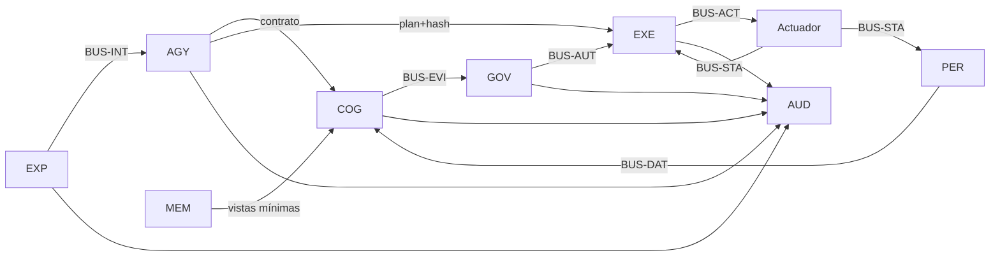

# Arquitectura ejecutiva

## Unidades fundamentales

- **Módulo lógico:** responsabilidad única identificada por `EXP-01`, `GOV-06`, etc.
- **Dominio:** familia de módulos con datos y responsabilidades afines.
- **Servicio:** proceso desplegable que aloja uno o varios módulos de un dominio.
- **Nodo:** frontera soberana que contiene servicios, políticas, identidad y recursos propios.
- **Circuito:** canal con semántica y privilegios específicos.
- **Contrato:** esquema versionado que define lo intercambiado.
- **Capacidad:** autorización limitada, firmada y vinculada a un plan.

## Dominios

| Dominio | Servicio | Responsabilidad |
|---|---|---|
| EXP | `experience-service` | Interacción, realidad declarada, influencia y consentimiento. |
| IDN | `identity-service` | Identidad, continuidad y delegación. |
| MEM | `memory-service` | Memoria, conocimiento, procedencia y olvido. |
| PER | `perception-service` | Sensores, validación y estado probabilístico. |
| COG | `cognition-service` | Razonamiento, simulación, hipótesis y crítica. |
| AGY | `agency-service` | Intenciones, planes y ciclo de misión. |
| GOV | `governance-service` | Constitución, riesgo, mandatos y capacidades. |
| EXE | `execution-service` | Pasarela, comandos, presupuestos y parada. |
| FED | `federation-service` | Nodos, protocolos, demoras y tratados. |
| SEC | `security-service` | Confianza, contención, integridad y detección. |
| AUD | `audit-service` | Registro, trazas, explicaciones e incidentes. |
| EVO | `evolution-service` | Versiones, candidatos, pruebas y despliegue. |
| TMP | `temporal-service` | Relojes, caducidad y justicia temporal. |
| RES | `resource-service` | Energía, materia, cómputo, atención y concentración. |

## Circuitos

## Condición de ejecución

La cadena gobernada solo llega a `execution-service` cuando existen:

1. Un plan firmado por `agency-service` y verificado previamente por Governance.
2. Una capacidad firmada por `governance-service` cuyo `plan_hash` y `arguments_hash` coinciden.
3. Evidencia de monitores activos.
4. Presupuestos atestados y transportados dentro de la capacidad.
5. Un canal de parada válido.

En el runtime 0.3 estas condiciones son código, no solo una regla conceptual. Experience solicita un ciclo a Cognition; Agency firma el plan; Identity firma el consentimiento; Governance verifica ambos y firma la capacidad. Rust no recibe la clave de Agency ni necesita confiar en Experience: conserva únicamente la clave pública de Governance y vuelve a calcular los hashes del plan y los parámetros. El contenido ejecutado queda ligado por `plan_hash` y `arguments_hash`.

El cableado, las tablas, endpoints, dominios de firma y fallos se especifican en `docs/architecture/agent-runtime-0.3.md`.

## Madurez

La tabla de dominios expresa la arquitectura objetivo. La capacidad realmente disponible de cada módulo se publica por separado en `registry/module-maturity.yaml`. Los estados forman una secuencia explícita: `declared → hosted → implemented → integrated → verified → production-ready`. Ningún host genérico se cuenta como motor funcional por el mero hecho de arrancar.

## Persistencia

- PostgreSQL: estado transaccional, identidades, misiones y metadatos.
- Almacén de objetos compatible con S3: paquetes de evidencia y artefactos grandes.
- Bus de eventos JetStream/NATS: eventos por circuitos y consumidores duraderos.
- Ledger de auditoría append-only: recibos encadenados y pruebas.
- OPA: evaluación de políticas versionadas.
- Vault/KMS abstracto: claves y secretos; nunca en manifiestos.

## Despliegue

El nodo mínimo contiene los 14 dominios, aunque varios pueden ejecutarse en un mismo clúster. Las fronteras lógicas se conservan mediante identidades de carga, políticas de red y cuentas de servicio separadas.

La topología completa se encuentra en `docs/architecture/deployment-topology.md`.

## Fuente normativa

Si existe contradicción:

1. `SCOPE.md` define el perímetro.
2. `registry/` define inventario y propiedad.
3. `schemas/` y `proto/` definen contratos.
4. `policies/` define decisiones ejecutables.
5. `docs/architecture/` explica la intención.
6. El código implementa lo anterior y no puede redefinirlo silenciosamente.
