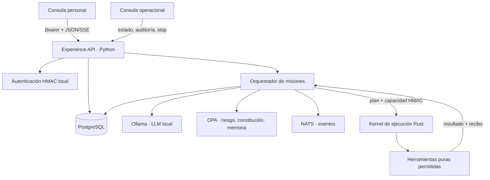

# Arquitectura ejecutable de Sheily 0.2

## Resultado implementado

Sheily 0.2 es un recorrido vertical funcional para conversación y análisis documental local. No es una AGI ni implementa las capacidades especulativas de 2300. Materializa la frontera más importante de esa arquitectura: un modelo propone, las políticas deciden y un kernel distinto ejecuta una capacidad estrecha.



## Cableado de una misión

1. La consola obtiene un token temporal en `POST /v1/auth/login`.
2. La persona crea una conversación y puede cargar texto, Markdown, CSV o PDF. El nombre se normaliza, el tamaño y el número de páginas se limitan y solo el texto extraído entra en el modelo.
3. `experience-service` persiste el mensaje, crea una misión `received` y abre su cadena de recibos.
4. `OllamaModel.plan` exige JSON conforme a `MissionPlan`; el esquema solo permite `conversation.answer` o `document.report`.
5. El plan se serializa de forma canónica y recibe un SHA-256. OPA calcula el riesgo y aplica la constitución. Leer documentos o escribir memoria exige aprobación humana.
6. Tras la aprobación, el orquestador emite una capacidad HMAC de un solo uso, con `plan_hash`, recurso, operación, monitores obligatorios, caducidad y límites de salida y tiempo.
7. El servicio Rust vuelve a calcular la firma y el hash, valida tiempo, operación, recurso, monitores, parada y uso previo. Rechaza cualquier herramienta fuera de su allowlist compilada.
8. El resultado vuelve como datos. Python comprueba que toda cita pertenece a un documento autorizado y que un informe documental incluye al menos una fuente.
9. Solo si la persona marcó y confirmó «recordar», OPA autoriza una memoria con retención de 30 días. El borrado lógico está expuesto en la consola.
10. Cada transición se encadena con `previous_receipt_hash` y se publica como `mission.event.v1`. La respuesta SSE permite observar la misión sin conceder acceso directo al ejecutor.

## Módulos concretos

| Módulo | Archivo principal | Responsabilidad | No puede hacer |
|---|---|---|---|
| API | `packages/python/noosfera_core/agent/api.py` | HTTP, CORS, autenticación, SSE y composición | Saltarse al kernel o inventar permisos |
| Autenticación | `agent/auth.py` | Credenciales locales y tokens HMAC temporales | Delegar identidad o autenticar terceros |
| Modelo | `agent/model_provider.py` | Plan y respuesta JSON mediante Ollama local | Ejecutar herramientas o conmutar a nube |
| Orquestador | `agent/orchestrator.py` | Máquina de estados y unión del recorrido | Autorizar una operación no contemplada |
| Gobierno | `agent/governance.py` | Consultar riesgo, constitución y memoria en OPA | Ejecutar el plan que evalúa |
| Persistencia | `agent/persistence.py` | Conversación, documento, misión, memoria, stop y recibos | Exponer documentos entre usuarios |
| Documentos | `agent/documents.py` | Validar y extraer texto o PDF | Procesar formatos activos o ilimitados |
| Eventos | `agent/events.py` | Publicar acontecimientos en NATS | Ser fuente de verdad transaccional |
| Cliente de ejecución | `agent/execution.py` | Transportar solicitudes al límite Rust | Interpretar lenguaje natural |
| Autoridad Rust | `noosfera-execution-service/src/main.rs` | Verificar capacidad y herramienta | Acceder al SO, red, dinero o dispositivos |
| Kernel Rust | `noosfera-execution-kernel/src/lib.rs` | Vincular plan canónico y capacidad | Modificar el plan autorizado |
| Capacidad Rust | `noosfera-capability/src/lib.rs` | Tiempo, uso, operación, recurso y monitores | Emitir su propia capacidad |
| Consola personal | `apps/personal-console` | Conversación, documentos, aprobación y memoria | Hablar directamente con Ollama o Rust |
| Consola operacional | `apps/operator-console` | Salud, auditoría y parada segura | Alterar recibos o planes |

## Estados y condiciones

```text
received → planning → awaiting-approval ─┬→ rejected
                    │                    └→ authorized
                    └──────────────────────→ authorized
authorized → executing → verifying → completed
                        ├────────────→ failed
                        └────────────→ stopped
```

Una transición no válida se rechaza. Una misión no continúa si faltan documentos, el modelo devuelve otro alcance, OPA no responde, la capacidad caducó, un monitor no está sano, la parada está activa, la evidencia no pertenece al usuario o la salida supera el límite.

## Fronteras de red

- La red `model` contiene Ollama y `experience-service`.
- La red `control` contiene API, OPA, NATS y Rust.
- La red `data` contiene PostgreSQL y servicios con datos.
- La red `audit` contiene el ejecutor y los componentes de auditoría.
- `edge` es la única red no interna del perfil de desarrollo y contiene la API y las consolas para que el navegador pueda alcanzarlas. Debe sustituirse por un ingress con denegación de salida en producción.
- `control`, `data`, `audit` y `model` son redes internas. Sus declaraciones de puerto son auxiliares de desarrollo y pueden no publicarse cuando el runtime aplica el aislamiento interno.
- El LLM no recibe credenciales de ejecución. El kernel Rust no recibe el historial completo ni el texto original de los documentos: recibe el plan autorizado y la salida candidata que debe validar.

## Persistencia

La migración `0007_agent_runtime.sql` crea tablas separadas para conversaciones, mensajes, documentos, misiones, acontecimientos, memorias y control. Los documentos se unen a su propietario. Las misiones conservan un snapshot JSON versionado y campos indexables. Los acontecimientos son append-only y cada recibo depende del anterior. El borrado de memoria conserva la prueba de que el borrado ocurrió sin devolver el contenido a la aplicación.

## Límites conocidos de 0.2

- La autenticación incluida es para un nodo local de una persona; una instalación multiusuario necesita un IdP y separación criptográfica de claves.
- El ledger de capacidades consumidas del proceso Rust es volátil; un despliegue de alta disponibilidad debe usar un registro transaccional compartido.
- El análisis soporta texto y PDF, no OCR, audio, vídeo ni contenido web.
- Las dos herramientas son transformaciones de datos. No existen aún herramientas de shell, red, correo, pagos, robótica ni modificación de archivos.
- La exactitud factual depende del modelo y de los documentos. Las citas verifican procedencia autorizada, no garantizan que cada afirmación sea verdadera.
- Compose es un entorno de desarrollo reproducible, no una receta de producción certificada.

Estos límites son deliberados: ampliar autoridad exige un contrato, una política, una amenaza, una herramienta Rust limitada y pruebas nuevas.
