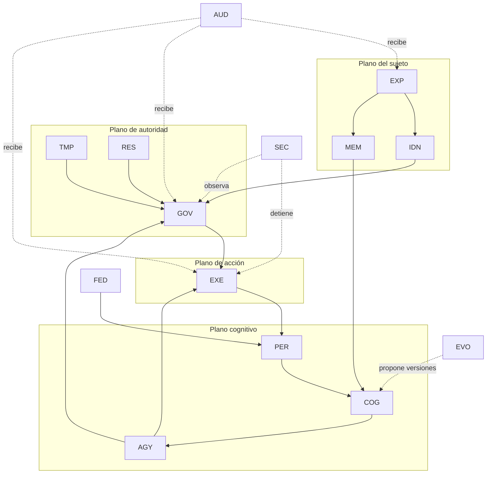

# Mapa de dominios

Los 14 dominios son fronteras de propiedad, no una obligación de desplegar 14 máquinas.

Los límites de dominio evitan transacciones distribuidas innecesarias. Las decisiones se enlazan mediante identificadores, hashes y recibos.
