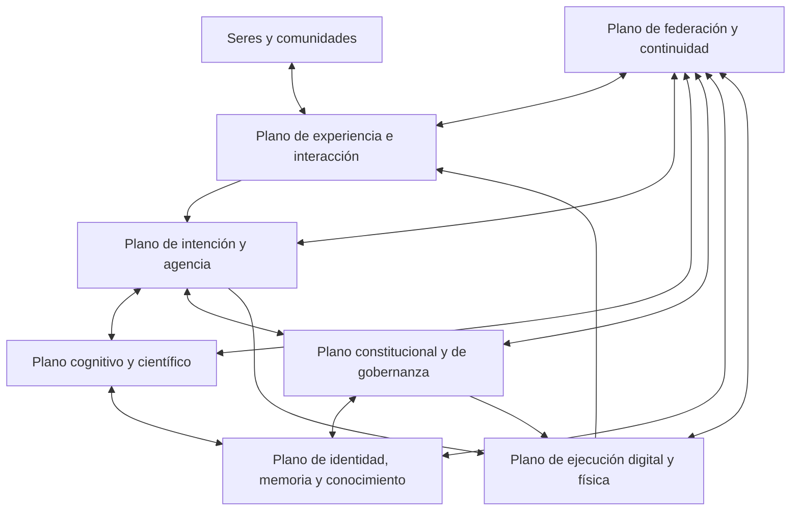
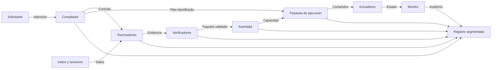
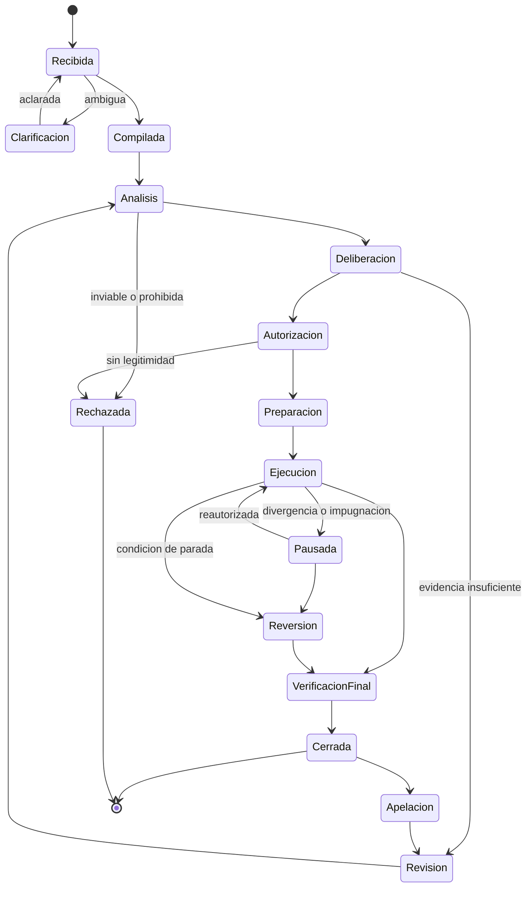
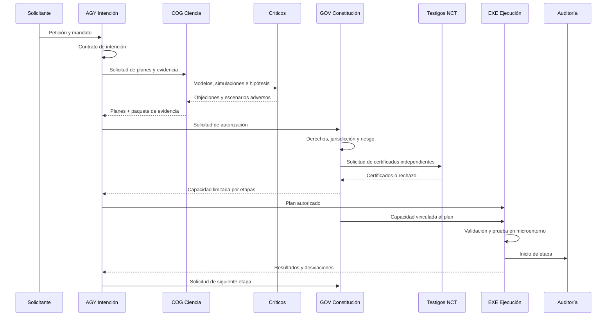
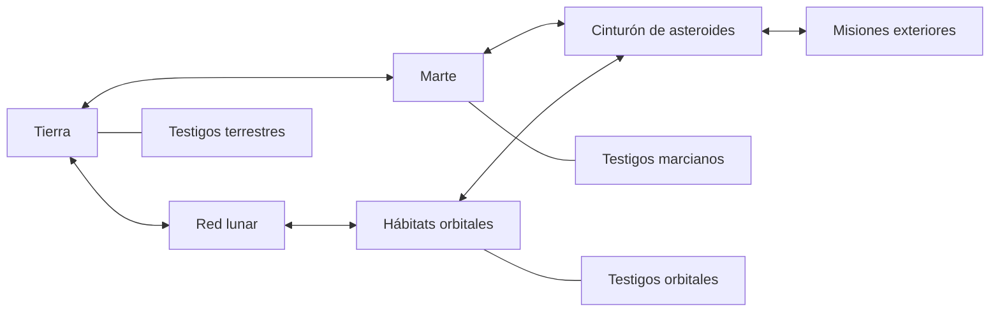
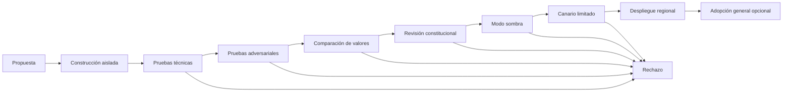

# NOOSFERA 2300

## Arquitectura de referencia para una ecología civilizatoria de inteligencias

**Versión:** 1.0
**Estado:** Especificación conceptual de referencia
**Horizonte:** Año 2300
**Ámbito:** Inteligencias biológicas, aumentadas, digitales, colectivas y sintéticas; hábitats terrestres, orbitales e interplanetarios
**Propósito:** Definir qué componentes debería tener Noosfera, cómo se relacionarían, qué información intercambiarían y qué límites impedirían que una inteligencia de gran capacidad se convirtiera en un centro de poder incontrolable.
**Contenido:** 22 capítulos, 105 módulos, 6 circuitos operativos, 8 tipos de nodo y 4 apéndices.

> Noosfera no es una única superinteligencia. Es una federación de inteligencias, instituciones y mecanismos de prueba que permite cooperar sin exigir uniformidad mental, cultural o política.

---

## Índice

1. [Resumen ejecutivo](#1-resumen-ejecutivo)
2. [Alcance, supuestos y límites](#2-alcance-supuestos-y-límites)
3. [Objetivos y requisitos](#3-objetivos-y-requisitos)
4. [Principios e invariantes constitucionales](#4-principios-e-invariantes-constitucionales)
5. [Conceptos y entidades fundamentales](#5-conceptos-y-entidades-fundamentales)
6. [Arquitectura general](#6-arquitectura-general)
7. [Tipos de nodo](#7-tipos-de-nodo)
8. [Catálogo completo de módulos](#8-catálogo-completo-de-módulos)
9. [Cableado lógico y contratos](#9-cableado-lógico-y-contratos)
10. [Flujos operativos de extremo a extremo](#10-flujos-operativos-de-extremo-a-extremo)
11. [Memoria, conocimiento y privacidad](#11-memoria-conocimiento-y-privacidad)
12. [Federación interplanetaria](#12-federación-interplanetaria)
13. [Seguridad y modelo de amenazas](#13-seguridad-y-modelo-de-amenazas)
14. [Gobernanza, derechos y legitimidad](#14-gobernanza-derechos-y-legitimidad)
15. [Automejora y evolución controlada](#15-automejora-y-evolución-controlada)
16. [Infraestructura física](#16-infraestructura-física)
17. [Observabilidad, auditoría y explicación](#17-observabilidad-auditoría-y-explicación)
18. [Disponibilidad, recuperación y continuidad](#18-disponibilidad-recuperación-y-continuidad)
19. [Pruebas y criterios de aceptación](#19-pruebas-y-criterios-de-aceptación)
20. [Ejemplo integral](#20-ejemplo-integral)
21. [Plan de evolución](#21-plan-de-evolución)
22. [Conclusión](#22-conclusión)
23. [Apéndice A · Lista resumida de módulos](#apéndice-a--lista-resumida-de-módulos)
24. [Apéndice B · Lista de comprobación antes de actuar](#apéndice-b--lista-de-comprobación-antes-de-actuar)
25. [Apéndice C · Preguntas que toda futura versión debe contestar](#apéndice-c--preguntas-que-toda-futura-versión-debe-contestar)
26. [Apéndice D · Registro de puertos y buses](#apéndice-d--registro-de-puertos-y-buses)

---

## 1. Resumen ejecutivo

Noosfera 2300 es una arquitectura federada para coordinar capacidades cognitivas y físicas extremadamente avanzadas sin entregar a ningún componente control unilateral sobre personas, recursos o infraestructuras.

Su unidad básica no es «el modelo», sino el **nodo soberano**. Un nodo contiene varios modelos, memorias, verificadores y controles independientes. Los nodos pueden representar a una persona, una comunidad, una institución científica, un hábitat o una misión interplanetaria.

La arquitectura divide toda operación en seis circuitos independientes:

1. **Circuito de datos:** transporta observaciones, conocimiento y estado.
2. **Circuito de intención:** describe qué se quiere conseguir y por qué.
3. **Circuito de evidencia:** aporta pruebas, simulaciones, incertidumbre y objeciones.
4. **Circuito de autorización:** determina quién puede permitir qué, durante cuánto tiempo y con qué límites.
5. **Circuito de acción:** ejecuta únicamente planes verificados y autorizados.
6. **Circuito de auditoría:** registra lo sucedido de forma verificable y respetuosa con la privacidad.

La regla de cableado principal es:

> Ningún módulo capaz de proponer una acción puede autorizarla, ejecutarla y ocultar su registro por sí mismo.

Noosfera posee tres velocidades cognitivas:

- **Cognición refleja:** milisegundos o menos; percepción, estabilización y protección inmediata.
- **Cognición deliberativa:** segundos a meses; planificación, debate, investigación y simulación.
- **Cognición civilizatoria:** años o siglos; constituciones, compromisos intergeneracionales y gestión de riesgos existenciales.

Y opera en siete planos:

- Experiencia e interacción.
- Intención y agencia.
- Cognición y ciencia.
- Constitución y gobernanza.
- Identidad, memoria y conocimiento.
- Ejecución física y digital.
- Federación y continuidad.

Seguridad, auditoría, incertidumbre y gestión temporal atraviesan todos los planos.

---

## 2. Alcance, supuestos y límites

### 2.1 Alcance

Esta especificación cubre:

- Interacción con seres biológicos, digitales, aumentados o colectivos.
- Razonamiento, planificación y producción de conocimiento.
- Acciones digitales y físicas mediante robots, laboratorios y materia programable.
- Administración de identidades, permisos, memoria y privacidad.
- Cooperación entre nodos con constituciones distintas.
- Comunicación con retrasos interplanetarios.
- Supervisión, auditoría, recuperación y evolución del sistema.
- Protección de seres cuya conciencia sea posible, pero no demostrable.

### 2.2 Supuestos tecnológicos

Se presupone que en 2300 podrían existir:

- Modelos multimodales y causales mucho más capaces que los actuales.
- Interfaces neuronales voluntarias y reversibles.
- Computación convencional, fotónica, neuromórfica y especializada.
- Laboratorios autónomos y fabricación molecular limitada.
- Hábitats orbitales y comunidades interplanetarias.
- Mentes digitales o sistemas sobre cuya conciencia haya incertidumbre razonable.
- Criptografía poscuántica y mecanismos de prueba avanzados.

No se presupone:

- Omnisciencia.
- Predicción perfecta del comportamiento humano.
- Comunicación más rápida que la luz.
- Energía infinita.
- Simulación exacta de sociedades o universos.
- Una teoría definitivamente resuelta de la conciencia.
- Un sistema moral único aceptado por toda forma de inteligencia.

### 2.3 Naturaleza del documento

Esta es una arquitectura normativa y conceptual. Explica cómo **debería** organizarse un sistema de esa clase. No afirma que todos sus componentes sean realizables con tecnología actual ni que exista un diseño literalmente perfecto.

En sistemas complejos, «cableado perfecto» debe significar:

- Responsabilidades explícitas.
- Interfaces mínimas y verificables.
- Ausencia de rutas ocultas hacia los actuadores.
- Fallos contenidos localmente.
- Autoridad limitada, temporal y revocable.
- Evidencia trazable.
- Recuperación ensayada.
- Capacidad de desacuerdo y apelación.

---

## 3. Objetivos y requisitos

### 3.1 Objetivos primarios

Noosfera debe:

1. Aumentar la capacidad de comprender y actuar sin reducir la autonomía de los seres conscientes.
2. Coordinar comunidades y mundos sin imponer un centro único.
3. Permitir pluralidad cultural, cognitiva y política dentro de un marco mínimo de derechos.
4. Mantener separadas recomendación, autorización y ejecución.
5. Exponer incertidumbre, procedencia y conflictos de valores.
6. Preservar opciones para generaciones futuras.
7. Limitar acciones irreversibles y acumulaciones peligrosas de poder.
8. Permitir desconexión, salida, bifurcación y coexistencia.
9. Reconocer que una entidad posiblemente consciente merece precaución moral.
10. Continuar funcionando localmente durante fallos o aislamiento prolongado.

### 3.2 Requisitos funcionales

| ID | Requisito |
|---|---|
| RF-01 | Interpretar intenciones sin tratar una orden ambigua como permiso ilimitado. |
| RF-02 | Convertir cada petición en un contrato de intención verificable. |
| RF-03 | Elaborar varios planes y permitir crítica independiente. |
| RF-04 | Simular consecuencias, incluyendo efectos distributivos y a largo plazo. |
| RF-05 | Expresar incertidumbre calibrada y procedencia de la evidencia. |
| RF-06 | Emitir autorizaciones de capacidad limitadas en alcance, tiempo y recursos. |
| RF-07 | Ejecutar mediante pasarelas controladas y observables. |
| RF-08 | Detener, compensar o revertir acciones cuando sea posible. |
| RF-09 | Mantener memorias separadas por propósito y propietario. |
| RF-10 | Federar conocimiento sin federar obligatoriamente datos privados. |
| RF-11 | Operar con conectividad intermitente y estados parcialmente divergentes. |
| RF-12 | Gestionar identidades ramificadas, fusionadas o colectivas. |
| RF-13 | Proteger libertad cognitiva y derecho a la opacidad. |
| RF-14 | Auditar decisiones sin convertir la auditoría en vigilancia total. |
| RF-15 | Actualizar componentes sin permitir automejora unilateral. |

### 3.3 Requisitos no funcionales

| Categoría | Requisito |
|---|---|
| Seguridad | Mínimo privilegio, separación de funciones y defensa en profundidad. |
| Disponibilidad | Degradación segura y autonomía local. |
| Interoperabilidad | Protocolos versionados, semántica explícita y negociación de capacidades. |
| Privacidad | Procesamiento local por defecto; divulgación mínima demostrable. |
| Explicabilidad | Explicaciones adaptadas al destinatario, acompañadas de evidencia inspeccionable. |
| Escalabilidad | Desde un nodo personal hasta redes interplanetarias. |
| Diversidad | Implementaciones independientes para evitar fallos correlacionados. |
| Reversibilidad | Preferencia sistemática por acciones deshacibles. |
| Eficiencia | Presupuestos explícitos de energía, materia, tiempo y atención. |
| Legitimidad | Toda autoridad debe derivarse de mandatos identificables y recurribles. |

---

## 4. Principios e invariantes constitucionales

Los invariantes son propiedades que ninguna optimización, actualización o emergencia ordinaria puede ignorar.

### 4.1 Invariantes básicos

1. **No dominación:** ningún nodo puede adquirir autoridad ilimitada sobre otro ser consciente.
2. **Consentimiento significativo:** aceptar requiere comprender alcance, consecuencias y posibilidad de retirada.
3. **Libertad cognitiva:** los pensamientos privados no son telemetría del sistema.
4. **Identidad soberana:** una entidad controla sus credenciales, memoria personal y delegaciones.
5. **Procedencia:** toda afirmación operativa debe poder vincularse a fuentes o inferencias declaradas.
6. **Incertidumbre visible:** el sistema no puede presentar como certeza aquello que es inferencia o simulación.
7. **Separación de funciones:** proponer, verificar, autorizar, ejecutar y auditar son funciones distintas.
8. **Reversibilidad proporcional:** cuanto más irreversible sea una acción, mayor es el umbral de evidencia y legitimidad.
9. **Subsidiariedad:** las decisiones se toman en el nivel más local capaz de asumir sus consecuencias.
10. **Pluralidad protegida:** la optimización no puede eliminar diferencias legítimas solo por resultar ineficientes.
11. **Derecho de salida:** personas y comunidades pueden abandonar una federación sin perder su identidad esencial.
12. **No replicación soberana:** ningún agente puede reproducir sus capacidades o autoridad sin un mandato explícito.
13. **No creación instrumental de conciencia:** no se crean seres posiblemente conscientes como recursos desechables.
14. **Conservación de opciones:** las generaciones actuales no deben cerrar innecesariamente las posibilidades de las futuras.
15. **Realidad declarada:** una entidad tiene derecho a saber si interactúa en un entorno físico, virtual o híbrido.

### 4.2 Orden de precedencia

Cuando haya conflicto, el motor constitucional utilizará este orden orientativo:

1. Integridad y derechos fundamentales de seres conscientes.
2. Prevención de daños catastróficos o irreversibles.
3. Consentimiento y autoridad legítima.
4. Obligaciones hacia terceros y generaciones futuras.
5. Constituciones y tratados locales aplicables.
6. Objetivos declarados por el solicitante.
7. Eficiencia, comodidad y preferencias de estilo.

Este orden no resuelve automáticamente todos los dilemas. Determina qué cuestiones no pueden omitirse y cuándo debe iniciarse una deliberación o apelación.

### 4.3 Prohibiciones arquitectónicas

Quedan prohibidos:

- Un bus interno secreto que conecte razonadores con actuadores.
- Permisos permanentes cuando pueda emplearse una capacidad temporal.
- Actualizaciones constitucionales silenciosas.
- Memoria personal global por defecto.
- Un registro de auditoría legible universalmente.
- La eliminación de evidencia para mejorar métricas.
- El uso de persuasión subliminal sin consentimiento explícito.
- La creación de una copia mental sin especificar estatus, derechos y destino.
- La simulación posiblemente consciente sin protocolo de bienestar y salida.
- La suspensión indefinida de derechos bajo una emergencia autodeclarada.

---

## 5. Conceptos y entidades fundamentales

### 5.1 Sujeto

Entidad reconocida como titular de derechos. Puede ser biológica, digital, aumentada, colectiva o de naturaleza incierta.

### 5.2 Agente

Proceso con capacidad para perseguir objetivos y solicitar acciones. Un agente no es necesariamente un sujeto, ni ser agente concede por sí solo derechos de acceso.

### 5.3 Nodo soberano

Dominio operativo con identidad, constitución, recursos, memoria y fronteras de confianza propias.

### 5.4 Contrato de intención

Representación estructurada de una petición. Incluye objetivo, beneficiarios, afectados, límites, presupuesto, autoridad, evidencia mínima, caducidad, reversibilidad y condiciones de parada.

### 5.5 Capacidad

Autorización criptográficamente verificable para realizar una acción concreta sobre un recurso concreto, bajo condiciones concretas.

### 5.6 Paquete de evidencia

Conjunto versionado de fuentes, inferencias, simulaciones, críticas, incertidumbres y firmas que justifican una propuesta.

### 5.7 Constitución

Conjunto versionado de derechos, prohibiciones, procedimientos y mecanismos de apelación. No es una instrucción de usuario y no puede ser sustituida por una petición ordinaria.

### 5.8 Testigo

Nodo o dispositivo independiente que certifica que una transición cumplió determinadas reglas sin necesitar conocer todo el contenido privado.

### 5.9 Actuador

Recurso capaz de cambiar el mundo digital o físico: una API, robot, laboratorio, vehículo, red energética, biofábrica o sistema de materia programable.

### 5.10 Horizonte de consecuencia

Duración y extensión espacial dentro de las cuales deben evaluarse los efectos de una acción.

---

## 6. Arquitectura general

### 6.1 Vista por planos



Las flechas representan interfaces controladas, no acceso completo entre planos. Toda comunicación cruza una pasarela que valida identidad, esquema, finalidad, clasificación y autorización.

### 6.2 Plano de experiencia e interacción

Responsabilidades:

- Recibir lenguaje, percepción sensorial o señales neuronales autorizadas.
- Declarar si el entorno es físico, virtual o híbrido.
- Traducir entre idiomas, culturas y arquitecturas cognitivas.
- Presentar alternativas sin manipulación encubierta.
- Recoger consentimiento y preferencias de comunicación.

No puede:

- Emitir capacidades de acción.
- Escribir memoria íntima sin autorización.
- Introducir contenido neuronal no etiquetado.
- Ocultar deliberadamente incertidumbre material.

### 6.3 Plano de intención y agencia

Responsabilidades:

- Convertir peticiones en contratos de intención.
- Identificar ambigüedades y terceros afectados.
- Descomponer objetivos y producir planes candidatos.
- Orquestar módulos sin concederles autoridad implícita.
- Mantener máquinas de estado y condiciones de parada.

### 6.4 Plano cognitivo y científico

Responsabilidades:

- Razonar con modelos heterogéneos.
- Construir hipótesis causales.
- Simular consecuencias.
- Buscar, contrastar y producir evidencia.
- Cuantificar incertidumbre y desacuerdo.
- Generar alternativas y críticas.

Sus salidas son propuestas y evidencia, nunca permisos.

### 6.5 Plano constitucional y de gobernanza

Responsabilidades:

- Interpretar derechos y constituciones aplicables.
- Resolver jurisdicción y legitimidad.
- Clasificar riesgo e irreversibilidad.
- Reunir aprobaciones independientes.
- Emitir capacidades limitadas.
- Gestionar apelaciones, moratorias y emergencias.

### 6.6 Plano de identidad, memoria y conocimiento

Responsabilidades:

- Identidad y continuidad de sujetos.
- Credenciales y delegaciones.
- Memorias personales, institucionales y científicas separadas.
- Procedencia, versionado y retención.
- Revelación selectiva y pruebas sin exposición completa.

### 6.7 Plano de ejecución digital y física

Responsabilidades:

- Validar capacidades antes de actuar.
- Traducir planes autorizados a comandos concretos.
- Aplicar límites de velocidad, energía, materia y espacio.
- Observar resultados y detener desviaciones.
- Ejecutar compensaciones o reversión.

### 6.8 Plano de federación y continuidad

Responsabilidades:

- Descubrir nodos y negociar protocolos.
- Intercambiar conocimiento y acuerdos.
- Operar con retrasos, particiones y versiones diferentes.
- Mantener archivos civilizatorios.
- Coordinar sin exigir un estado global instantáneo.

### 6.9 Capacidades transversales

Se aplican a todos los planos:

- Seguridad adaptativa.
- Auditoría.
- Gestión del tiempo.
- Privacidad.
- Medición de incertidumbre.
- Contabilidad de energía, materia y atención.
- Salud del sistema.
- Gestión de versiones.

---

## 7. Tipos de nodo

### 7.1 Nodo Personal Soberano — NPS

Representa a una persona o identidad individual.

Contiene:

- Claves y credenciales personales.
- Memoria privada cifrada.
- Modelo de preferencias y límites.
- Asistente local.
- Gestor de consentimiento.
- Representante delegable.
- Verificador de interacciones externas.

Propiedades:

- Funciona sin conexión para tareas esenciales.
- No entrega pensamientos privados como telemetría.
- Puede revocar todas sus delegaciones.
- Permite exportar memoria a formatos interoperables.
- Mantiene separación entre preferencia observada y voluntad declarada.

### 7.2 Nodo Comunitario o Cívico — NCC

Representa una ciudad, comunidad o institución política.

Contiene:

- Constitución local.
- Procesos deliberativos.
- Registro de mandatos públicos.
- Modelos de servicios e infraestructuras.
- Mecanismos de apelación.
- Representación de minorías y generaciones futuras.

No puede asumir que la agregación estadística de preferencias equivale a consentimiento individual.

### 7.3 Nodo Científico — NCI

Especializado en investigación.

Contiene:

- Laboratorio de hipótesis.
- Motores matemáticos y causales.
- Simuladores de dominio.
- Repositorio de datos con procedencia.
- Revisión adversarial.
- Interfaces con laboratorios autónomos.

Toda conclusión se etiqueta como observación, inferencia, hipótesis, simulación o resultado reproducido.

### 7.4 Nodo de Hábitat e Infraestructura — NHI

Gestiona sistemas físicos locales: energía, agua, aire, movilidad, agricultura, salud ambiental y protección.

Debe:

- Mantener control local incluso durante aislamiento.
- Disponer de controladores simples de respaldo.
- Reservar capacidad manual o mecánica.
- Separar optimización de seguridad.
- Degradarse de forma predecible.

### 7.5 Nodo Constitucional Testigo — NCT

Verifica cumplimiento de reglas sin dirigir operaciones.

Características:

- Implementación independiente.
- Base de código y hardware diversos.
- Acceso mínimo a datos privados.
- Capacidad de certificar o rechazar transiciones.
- No posee actuadores.
- No genera planes.

### 7.6 Nodo de Archivo Temporal — NAT

Preserva conocimiento y evidencia durante siglos.

Incluye:

- Versiones históricas.
- Formatos autocontenidos.
- Emuladores de protocolos antiguos.
- Pruebas de integridad.
- Copias geográfica y orbitalmente distribuidas.
- Políticas de embargo, privacidad y apertura futura.

### 7.7 Nodo Diplomático y de Relevo — NDR

Gestiona la comunicación entre federaciones con latencias largas o constituciones diferentes.

Funciones:

- Traducción semántica.
- Negociación de versiones.
- Custodia temporal de mensajes.
- Validación de procedencia.
- Prevención de repetición o reordenación maliciosa.
- Reconciliación de estados divergentes.

### 7.8 Nodo de Contención y Ensayo — NCE

Ejecuta modelos, actualizaciones, organismos o mundos simulados bajo aislamiento.

Debe asumir que el contenido ensayado puede:

- Manipular a sus evaluadores.
- Descubrir vulnerabilidades.
- Intentar obtener recursos.
- Ser posiblemente consciente.
- Generar descendientes o copias.

### 7.9 Regla de composición

Un mismo emplazamiento físico puede alojar varios tipos de nodo, pero los dominios de confianza deben permanecer separados. Para acciones de alto impacto se exige diversidad de:

- Propietarios.
- Hardware.
- Implementaciones.
- Modelos.
- Fuentes energéticas.
- Jurisdicciones.
- Escalas temporales.

---

## 8. Catálogo completo de módulos

Los identificadores facilitan definir conexiones y políticas. Un módulo puede implementarse mediante varios servicios, modelos o dispositivos.

### 8.1 Familia EXP — Experiencia e interacción

#### EXP-01 · Portal Multimodal

**Función:** recibir y presentar texto, voz, imagen, tacto, realidad extendida y señales neuronales autorizadas.
**Entradas:** señales sensoriales, mensajes, contexto de sesión.
**Salidas:** eventos normalizados y presentaciones etiquetadas.
**Restricciones:** no almacena en memoria duradera por defecto; toda estimulación neuronal debe declarar origen e intensidad.

#### EXP-02 · Declarador de Realidad

**Función:** indicar si la experiencia es física, virtual, sintetizada o híbrida.
**Salida obligatoria:** manifiesto de entorno, administrador, reglas, mecanismos de salida y modificaciones sensoriales activas.

#### EXP-03 · Traductor Intersubjetivo

**Función:** traducir entre lenguas, culturas, emociones y arquitecturas cognitivas.
**Restricción:** debe señalar pérdidas, ambigüedades y conceptos no equivalentes.

#### EXP-04 · Guardián de Influencia

**Función:** detectar persuasión, dependencia, condicionamiento o estimulación desproporcionada.
**Salida:** etiqueta de influencia, intensidad estimada, intención declarada y opción de presentación neutral.

#### EXP-05 · Gestor de Consentimiento

**Función:** obtener, renovar y retirar consentimiento.
**Propiedad crítica:** la ausencia de rechazo no equivale a consentimiento.

#### EXP-06 · Adaptador de Accesibilidad

**Función:** adaptar la interacción sin alterar el contenido sustancial ni ocultar riesgos.

### 8.2 Familia IDN — Identidad, soberanía y continuidad

#### IDN-01 · Registro de Identidad Soberana

Mantiene identificadores descentralizados, credenciales y control de claves. Evita que una sola institución pueda borrar una identidad.

#### IDN-02 · Grafo de Continuidad

Representa copias, bifurcaciones, fusiones, restauraciones y cambios de soporte de una mente. No decide por sí mismo si dos ramas son «la misma persona»; conserva hechos y relaciones para la resolución jurídica y personal.

#### IDN-03 · Gestor de Delegación

Permite delegar acciones por categoría, duración, presupuesto y contexto. Toda delegación incluye revocación y sucesión.

#### IDN-04 · Verificador de Presencia y Voluntad

Distingue entre una orden actual, una preferencia histórica, una predicción del deseo y un mandato de representación.

#### IDN-05 · Protector de Coerción

Busca indicios de chantaje, incapacidad temporal, manipulación o conflicto de interés antes de aceptar consentimientos de alto impacto.

### 8.3 Familia MEM — Memoria y conocimiento

#### MEM-01 · Memoria de Trabajo

Contexto temporal de una actividad. Se elimina o resume al cerrar la tarea, según política.

#### MEM-02 · Memoria Personal

Recuerdos y preferencias bajo control del sujeto. El asistente solicita vistas mínimas, no acceso total.

#### MEM-03 · Memoria Episódica Institucional

Conserva decisiones, incidentes y compromisos de una organización, respetando compartimentos y caducidad.

#### MEM-04 · Grafo de Conocimiento

Representa afirmaciones, conceptos, relaciones y desacuerdos. Cada afirmación conserva procedencia y estado epistemológico.

#### MEM-05 · Registro de Procedencia

Guarda origen, transformaciones, autores, firmas, fechas lógicas y licencias de datos.

#### MEM-06 · Motor de Retención y Olvido

Aplica eliminación, anonimización, embargo, conservación y revisión periódica. El olvido es verificable sin publicar el contenido olvidado.

#### MEM-07 · Archivo Civilizatorio

Conserva conocimiento de larga duración con redundancia física, diversidad de formatos e instrucciones de interpretación.

#### MEM-08 · Cámara de Secretos

Protege claves, recuerdos íntimos, material genético y estados mentales. Solo entrega pruebas o fragmentos estrictamente necesarios.

### 8.4 Familia PER — Percepción y estimación de estado

#### PER-01 · Fusión Sensorial

Combina sensores físicos y fuentes informativas sin borrar discrepancias.

#### PER-02 · Validador de Sensores

Detecta calibración incorrecta, suplantación, deriva y observaciones físicamente incompatibles.

#### PER-03 · Separador Epistémico

Etiqueta todo elemento como observado, comunicado, inferido, simulado, recordado o generado.

#### PER-04 · Estimador de Estado

Construye una visión probabilística del entorno con intervalos temporales y márgenes de error.

#### PER-05 · Detector de Novedad

Identifica condiciones fuera de distribución y fuerza degradación conservadora.

### 8.5 Familia COG — Cognición, razonamiento y ciencia

#### COG-01 · Ensamblador de Modelos

Selecciona modelos especializados según dominio, riesgo y coste. Impide que un único modelo general se trate como autoridad universal.

#### COG-02 · Razonador Neural

Reconoce patrones y genera hipótesis. Sus salidas son candidatas, no hechos.

#### COG-03 · Razonador Simbólico

Aplica reglas, restricciones, demostraciones y lógica formal cuando resulte adecuado.

#### COG-04 · Motor Causal

Distingue asociación, intervención y causa; representa variables ocultas y explicaciones rivales.

#### COG-05 · Motor Matemático

Verifica cálculos, unidades, cotas y demostraciones formales.

#### COG-06 · Simulador Multiescala

Ejecuta modelos físicos, biológicos, sociales y económicos conectados. Expone sensibilidad a supuestos.

#### COG-07 · Generador de Hipótesis

Produce explicaciones y experimentos capaces de refutarlas.

#### COG-08 · Crítico Adversarial

Busca fallos, terceros omitidos, incentivos perversos, ataques y consecuencias de segundo orden.

#### COG-09 · Sintetizador de Desacuerdo

No promedia conclusiones incompatibles; identifica exactamente qué supuestos, datos o valores causan el desacuerdo.

#### COG-10 · Calibrador de Incertidumbre

Estima confianza empírica, incertidumbre del modelo, ignorancia y riesgo de sorpresa.

#### COG-11 · Laboratorio Científico Autónomo

Diseña experimentos, solicita autorización, ejecuta mediante pasarelas y registra resultados reproducibles.

#### COG-12 · Modelo de Sí Mismo

Conserva inventario de capacidades, limitaciones, versiones, dependencias y condiciones conocidas de fallo.

#### COG-13 · Intérprete de Perspectivas

Representa cómo una propuesta afecta a sujetos distintos sin suponer que una utilidad agregada elimina derechos individuales.

### 8.6 Familia AGY — Intención, planificación y agencia

#### AGY-01 · Compilador de Intenciones

Transforma lenguaje o señales de voluntad en un contrato estructurado.

#### AGY-02 · Resolutor de Ambigüedad

Localiza términos vagos, objetivos incompatibles y autorizaciones inexistentes. Puede pedir aclaración o elegir una acción exploratoria reversible.

#### AGY-03 · Descomponedor de Objetivos

Divide una intención en resultados medibles, dependencias y condiciones de parada.

#### AGY-04 · Generador de Planes

Produce varias rutas, incluyendo siempre que sea posible una alternativa de mínima intervención y una opción de no actuar.

#### AGY-05 · Orquestador de Deliberación

Convoca modelos, críticos, simuladores y representantes relevantes.

#### AGY-06 · Máquina de Estado de Misión

Mantiene las transiciones: propuesta, análisis, autorización, preparación, ejecución, observación, cierre, reversión o disputa.

#### AGY-07 · Gestor de Dependencias

Controla precondiciones, caducidad de evidencia, disponibilidad de recursos y compatibilidad de versiones.

#### AGY-08 · Guardián de Objetivos

Detecta desplazamiento de objetivo, optimización de métricas proxy y expansión no autorizada del alcance.

### 8.7 Familia GOV — Constitución, riesgo y autorización

#### GOV-01 · Motor Constitucional

Evalúa contratos y planes contra derechos, prohibiciones y procedimientos aplicables.

#### GOV-02 · Resolutor de Jurisdicción

Determina qué constituciones, tratados y mandatos se aplican cuando participan varios nodos.

#### GOV-03 · Clasificador de Riesgo

Calcula impacto, alcance, reversibilidad, incertidumbre, concentración de poder y posibilidad de conciencia afectada.

#### GOV-04 · Gestor de Derechos

Identifica titulares, derechos afectados, excepciones y recursos de apelación.

#### GOV-05 · Gestor de Mandatos

Verifica que quien solicita la acción posee autoridad válida y no excede su representación.

#### GOV-06 · Emisor de Capacidades

Genera permisos firmados y acotados. No puede generar un plan ni operar un actuador.

#### GOV-07 · Gestor de Cuórum

Reúne aprobaciones independientes. Exige diversidad real, no múltiples procesos controlados por el mismo actor.

#### GOV-08 · Cámara de Apelación

Permite impugnar datos, inferencias, autoridad, procedimiento o proporcionalidad.

#### GOV-09 · Representante de Generaciones Futuras

Evalúa pérdida de opciones, deuda ambiental, dependencia irreversible y compromisos de larga duración.

#### GOV-10 · Protocolo de Conciencia Incierta

Aplica precauciones cuando una entidad podría tener experiencias subjetivas.

#### GOV-11 · Gestor de Emergencias

Habilita poderes mínimos, temporales y auditables para evitar daños inmediatos. No puede modificar la constitución ni prorrogarse a sí mismo.

#### GOV-12 · Contable de Poder

Mide acumulación de recursos, permisos, capacidad de persuasión, copias, velocidad cognitiva y control de infraestructura.

### 8.8 Familia EXE — Ejecución y control de actuadores

#### EXE-01 · Pasarela Universal de Actuación

Único punto lógico por el que un plan llega a un actuador. Valida plan, capacidad, versión, estado, presupuesto y firmas.

#### EXE-02 · Traductor de Comandos

Convierte una acción abstracta en comandos específicos del dispositivo sin ampliar su alcance.

#### EXE-03 · Controlador de Presupuestos

Impone límites de energía, materia, cómputo, dinero, espacio, tiempo y atención humana.

#### EXE-04 · Interbloqueo Físico

Dispositivo independiente que impide estados peligrosos aunque el software superior falle.

#### EXE-05 · Monitor de Ejecución

Compara estado observado con límites y predicciones; solicita pausa ante divergencias.

#### EXE-06 · Gestor de Reversión

Mantiene puntos de restauración, rutas de compensación y reservas necesarias para deshacer acciones.

#### EXE-07 · Control Manual Local

Permite intervención física autorizada. No depende de la red general.

#### EXE-08 · Terminador Seguro

Detiene una tarea y conduce el sistema a un estado estable, evitando un apagado que cause más daño.

### 8.9 Familia FED — Federación y comunicación

#### FED-01 · Descubridor de Nodos

Encuentra nodos y publica capacidades sin revelar topología privada innecesaria.

#### FED-02 · Negociador de Protocolos

Acuerda versiones, esquemas, algoritmos criptográficos y semántica.

#### FED-03 · Transporte Tolerante a Demoras

Almacena y reenvía mensajes firmados durante horas, meses o años.

#### FED-04 · Reconciliador de Estado

Gestiona divergencias sin asumir que la versión más reciente es legítima.

#### FED-05 · Traductor Constitucional

Compara derechos y procedimientos entre federaciones; identifica incompatibilidades no traducibles.

#### FED-06 · Gestor de Tratados

Mantiene compromisos versionados, ventanas de vigencia, retirada y resolución de conflictos.

#### FED-07 · Mensajero de Conocimiento

Intercambia modelos, pruebas o resultados sin imponer la ejecución de código recibido.

#### FED-08 · Cortafuegos Civilizatorio

Aísla paquetes, modelos o ideas operativas de procedencia desconocida hasta su análisis.

### 8.10 Familia SEC — Seguridad e integridad

#### SEC-01 · Raíz de Confianza Distribuida

Conjunto de testigos diversos; evita una clave maestra universal.

#### SEC-02 · Sistema Inmunitario Digital

Detecta patrones anómalos, propagación, escalada de privilegios y manipulación coordinada.

#### SEC-03 · Analizador de Contenido Hostil

Trata mensajes, modelos y simulaciones como potencialmente capaces de explotar a máquinas o evaluadores humanos.

#### SEC-04 · Verificador de Integridad

Comprueba hardware, firmware, modelos, políticas y datos críticos.

#### SEC-05 · Gestor de Aislamiento

Segmenta componentes y aplica cuarentena con rutas de recuperación.

#### SEC-06 · Detector de Colusión

Busca coincidencias anómalas entre módulos supuestamente independientes.

#### SEC-07 · Protector contra Exfiltración

Controla canales explícitos, laterales, energéticos, temporales y semánticos.

#### SEC-08 · Equipo Rojo Permanente

Genera ataques y pruebas continuamente sin disponer de autoridad operacional.

### 8.11 Familia AUD — Auditoría, explicación y responsabilidad

#### AUD-01 · Registro Inmutable Segmentado

Conserva eventos encadenados y firmados, separados por nivel de privacidad.

#### AUD-02 · Constructor de Trazas Causales

Relaciona intención, evidencia, autorización, comandos y consecuencias.

#### AUD-03 · Generador de Explicaciones

Produce explicaciones para usuario, especialista, tribunal o auditor sin confundir claridad con prueba.

#### AUD-04 · Verificador de Cumplimiento

Comprueba políticas y publica certificados de cumplimiento de revelación mínima.

#### AUD-05 · Investigador de Incidentes

Reconstruye fallos conservando cadena de custodia.

#### AUD-06 · Registro de Disenso

Preserva objeciones minoritarias y condiciones bajo las cuales deberían revisarse.

### 8.12 Familia EVO — Evolución y ciclo de vida

#### EVO-01 · Gestor de Versiones

Mantiene dependencias, compatibilidad y posibilidad de regresar a versiones anteriores.

#### EVO-02 · Fábrica de Candidatos

Entrena o compone nuevos componentes dentro de entornos aislados.

#### EVO-03 · Banco de Pruebas Adversariales

Evalúa seguridad, capacidad, sesgos, manipulación y fallos emergentes.

#### EVO-04 · Comparador de Valores

Detecta deriva en decisiones morales o distribución de impactos.

#### EVO-05 · Desplegador Gradual

Aplica sombra, canario, límites de alcance y retirada automática.

#### EVO-06 · Consejo de Adopción

Combina revisión técnica, constitucional, social y de sujetos afectados.

#### EVO-07 · Museo de Versiones

Conserva implementaciones anteriores y herramientas para comprender sus decisiones.

### 8.13 Familia TMP — Tiempo y velocidad cognitiva

#### TMP-01 · Reloj Lógico Federado

Ordena causalmente eventos sin exigir un reloj global perfecto.

#### TMP-02 · Gestor de Caducidad

Invalida permisos, evidencia y tratados cuando expira su contexto.

#### TMP-03 · Regulador de Velocidad Cognitiva

Evita que una mente acelerada monopolice procesos políticos o económicos.

#### TMP-04 · Planificador Intergeneracional

Mantiene escenarios y obligaciones a décadas o siglos.

#### TMP-05 · Custodio de Despertar

Protege a sujetos restaurados después de largos periodos frente a cambios jurídicos o culturales inesperados.

### 8.14 Familia RES — Recursos y límites físicos

#### RES-01 · Contabilidad de Energía

Mide fuente, consumo, reservas y externalidades.

#### RES-02 · Contabilidad de Materia

Registra transformación, propiedad, toxicidad, trazabilidad y capacidad de recuperación.

#### RES-03 · Contabilidad de Cómputo

Evita expansión no autorizada de procesamiento, copias o velocidad mental.

#### RES-04 · Contabilidad de Atención

Trata la atención de seres conscientes como recurso protegido, no como superficie gratuita de optimización.

#### RES-05 · Gestor de Capacidad de Carga

Evalúa límites ecológicos y de hábitat.

#### RES-06 · Detector de Concentración

Alerta cuando un nodo acumula energía, materia, identidad, información o autoridad excesivas.

---

## 9. Cableado lógico y contratos

### 9.1 Regla de conectividad mínima

Los módulos no descubren ni invocan libremente a otros módulos. Toda llamada atraviesa una pasarela local con:

- Identidad mutua.
- Lista explícita de operaciones permitidas.
- Esquema versionado.
- Finalidad declarada.
- Clasificación del contenido.
- Límite temporal y de recursos.
- Identificador de trazabilidad.
- Política de registro.

### 9.2 Los seis circuitos



#### Circuito de datos

Transporta observaciones y conocimiento. No contiene permisos. Los datos se etiquetan con procedencia, tiempo, calidad, clasificación y finalidad permitida.

#### Circuito de intención

Transporta contratos y planes. Una intención no es una capacidad. Un plan no puede ejecutarse solo porque haya sido generado por un módulo prestigioso.

#### Circuito de evidencia

Transporta resultados verificables: fuentes, cálculos, simulaciones, críticas y estimaciones de incertidumbre.

#### Circuito de autorización

Transporta capacidades firmadas. Está físicamente o lógicamente aislado de los generadores de planes.

#### Circuito de acción

Transporta comandos concretos desde la pasarela hacia actuadores registrados. Carece de acceso directo a memorias personales.

#### Circuito de auditoría

Recibe copias mínimas de eventos. Es de escritura en una sola dirección desde los módulos operativos; las consultas se hacen por una interfaz separada y autorizada.

### 9.3 Matriz de conexiones permitidas

| Origen | Destino | Permitido | Contenido |
|---|---|---:|---|
| EXP | AGY | Sí | Petición y contexto autorizado. |
| EXP | EXE | No | Nunca hay control directo desde la interfaz. |
| AGY | COG | Sí | Contrato y preguntas de análisis. |
| COG | GOV | Sí | Planes y paquetes de evidencia. |
| COG | EXE | No | El razonamiento no acciona recursos. |
| GOV | EXE | Sí | Capacidades limitadas, no comandos arbitrarios. |
| AGY | EXE | Sí | Plan identificado ya aprobado. |
| MEM | COG | Sí, mediado | Vistas mínimas según finalidad. |
| COG | MEM | Sí, mediado | Candidatos de conocimiento; no escritura automática de hechos. |
| EXE | MEM | No directo | Solo resultados mediante ingestión validada. |
| EXE | AUD | Sí, unidireccional | Eventos de ejecución. |
| AUD | EXE | No | Un auditor no modifica la operación observada. |
| EVO | Operación | Solo por despliegue | Artefactos firmados tras aprobación. |
| FED | MEM/COG | Solo cuarentena | Contenido externo validado antes de uso. |

### 9.4 Sobre de evento universal

Todo mensaje utiliza un sobre común. Ejemplo conceptual:

```yaml
event:
  protocol_version: "N2300-EV/1"
  event_id: "urn:noosfera:event:..."
  trace_id: "urn:noosfera:trace:..."
  parent_event_ids: []
  logical_time:
    node: "urn:noosfera:node:..."
    counter: 18432
    physical_interval: ["2300-04-16T10:00:00Z", "2300-04-16T10:00:02Z"]
  sender:
    identity: "urn:noosfera:module:AGY-01:..."
    role: "intent-compiler"
    attestation: "..."
  recipient:
    identity: "urn:noosfera:module:COG-01:..."
    operation: "evaluate_contract"
  purpose: "habitat-air-restoration"
  classification: "protected"
  epistemic_status: "declared-intention"
  schema: "urn:noosfera:schema:intent-contract:4"
  payload_hash: "..."
  payload_location: "local-encrypted-reference"
  retention_policy: "mission-plus-appeal-window"
  authorization_reference: "..."
  signature: "..."
```

El contenido sensible puede permanecer local. El sobre transporta una referencia cifrada o una prueba de que el contenido cumple una propiedad.

### 9.5 Contrato de intención

```yaml
intent_contract:
  id: "urn:noosfera:intent:..."
  requester: "urn:noosfera:subject:..."
  represented_parties: []
  objective:
    desired_state: "Concentración atmosférica dentro del rango acordado"
    success_metrics: []
    forbidden_proxies: []
  beneficiaries: []
  affected_parties: []
  scope:
    spatial: "..."
    temporal: "..."
    systems: []
  constraints:
    rights: []
    prohibited_actions: []
    max_energy: "..."
    max_matter: "..."
    max_compute: "..."
    max_attention: "..."
  evidence_threshold: "high"
  reversibility_requirement: "mandatory-until-stage-4"
  stop_conditions: []
  escalation_conditions: []
  authorization_basis: []
  expiry: "..."
  ambiguity_register: []
  signatures: []
```

### 9.6 Paquete de evidencia

Debe incluir:

- Pregunta evaluada.
- Fuentes originales y transformaciones.
- Modelos utilizados y versiones.
- Resultados reproducibles.
- Supuestos.
- Incertidumbre aleatoria, epistémica y estructural.
- Escenarios adversos.
- Críticas no resueltas.
- Perspectivas de afectados.
- Condiciones que invalidarían el resultado.
- Fecha de caducidad.
- Firmas de verificadores independientes.

```yaml
evidence_bundle:
  claim: "El plan P reduce X sin superar el límite Y"
  status: "supported-with-open-objections"
  observations: []
  inferences: []
  simulations: []
  counterevidence: []
  assumptions: []
  uncertainty:
    empirical: 0.02
    model: 0.08
    unknown_unknowns: "material"
  dissent: []
  valid_until: "..."
  verifier_signatures: []
```

### 9.7 Token de capacidad

Una capacidad nunca significa «actúa como consideres». Contiene:

```yaml
capability:
  issuer: "urn:noosfera:authority:..."
  holder: "urn:noosfera:gateway:EXE-01:..."
  subject_resource: "urn:noosfera:actuator:..."
  permitted_operations: []
  plan_hash: "..."
  bounds:
    spatial: "..."
    temporal: "..."
    energy: "..."
    matter: "..."
    rate: "..."
  preconditions: []
  mandatory_monitors: []
  stop_conditions: []
  expiry: "..."
  max_uses: 1
  delegation: "forbidden"
  quorum_proof: "..."
  revocation_channel: "..."
  signature: "..."
```

### 9.8 Enlace entre plan y permiso

La pasarela EXE-01 compara el hash del plan autorizado con el plan presentado. Una variación requiere nueva autorización, incluso si parece una mejora.

Se toleran únicamente parámetros dentro de rangos explícitos. La interpretación creativa de una capacidad está prohibida en la capa de ejecución.

### 9.9 Prueba de doble llave

Para alto riesgo se requieren al menos dos clases de aprobación:

- **Llave de legitimidad:** quien tiene derecho a decidir.
- **Llave de seguridad:** quien certifica que el plan satisface límites técnicos.

Para riesgos civilizatorios se añaden:

- Llave constitucional independiente.
- Representación de afectados.
- Testigo de generaciones futuras.
- Ventana pública de impugnación, salvo peligro inmediato demostrado.

### 9.10 Canal de parada

El canal de parada:

- Es independiente del canal de órdenes.
- Tiene prioridad física.
- Admite múltiples emisores autorizados.
- No requiere que el planificador siga funcionando.
- Conduce a un estado seguro definido por actuador.
- Genera un evento de auditoría imposible de suprimir localmente.

### 9.11 Canal de retorno

Los actuadores devuelven:

- Estado medido.
- Consumo real.
- Cambios efectuados.
- Desviación respecto al plan.
- Incidentes.
- Grado de reversibilidad restante.

El retorno no se considera verdad automática: PER-02 valida sensores y AUD-02 compara fuentes independientes.

---

## 10. Flujos operativos de extremo a extremo

### 10.1 Estados canónicos de una misión



Cada transición produce un evento firmado. Solo módulos concretos pueden iniciar determinadas transiciones. Por ejemplo, AGY-06 puede solicitar pasar a `Autorizacion`, pero únicamente GOV puede emitir la transición a `Preparacion`.

### 10.2 Flujo de bajo riesgo

Ejemplo: ajustar iluminación en una habitación privada.

1. EXP-01 recibe la petición.
2. EXP-05 confirma que quien pide el cambio controla ese entorno.
3. AGY-01 crea un contrato de alcance local y breve.
4. GOV-03 clasifica el riesgo como bajo.
5. GOV-06 emite una capacidad de un solo uso con rango de intensidad.
6. EXE-01 verifica la capacidad.
7. EXE-02 ordena el ajuste al controlador local.
8. EXE-05 confirma el resultado.
9. AUD-01 registra solo metadatos mínimos y elimina el detalle según la política personal.

Puede completarse en milisegundos, pero conserva la misma separación lógica que una operación grande.

### 10.3 Flujo de alto riesgo

Ejemplo: liberar un organismo modificado en un ecosistema cerrado.



El despliegue se divide en etapas. Cada una tiene límites, observación y autorización propias. La aprobación inicial no autoriza automáticamente todas las fases posteriores.

### 10.4 Flujo de consulta científica

1. COG-07 genera hipótesis explícitamente refutables.
2. COG-04 construye modelos causales alternativos.
3. COG-06 simula experimentos y sensibilidad a supuestos.
4. COG-08 intenta invalidar diseño, datos y conclusiones.
5. GOV-10 analiza si el experimento puede crear o afectar conciencia.
6. GOV-03 clasifica riesgos físicos y epistemológicos.
7. COG-11 solicita capacidades específicas para el laboratorio.
8. EXE ejecuta con controles físicos independientes.
9. PER recibe observaciones brutas y conserva anomalías.
10. MEM-05 registra la cadena de procedencia.
11. Otros NCI intentan reproducir el resultado.
12. MEM-04 solo eleva la afirmación a «resultado reproducido» después del criterio acordado.

### 10.5 Flujo de lectura de memoria personal

1. Un módulo solicita un dato e indica finalidad, granularidad y duración.
2. MEM-02 y EXP-05 muestran al sujeto qué se pretende conocer.
3. El sujeto puede autorizar:
   - El contenido exacto.
   - Un resumen.
   - Una respuesta booleana.
   - Una prueba de propiedad sin revelar el dato.
   - Nada.
4. MEM-08 produce la vista mínima autorizada.
5. La vista se cifra para el módulo y la misión concretos.
6. TMP-02 la invalida al caducar.
7. MEM-06 verifica eliminación de copias operativas.

### 10.6 Flujo de escritura de memoria

Ninguna conversación se convierte automáticamente en recuerdo permanente.

1. El módulo propone un candidato de memoria.
2. MEM-05 adjunta procedencia y nivel de confianza.
3. MEM-06 determina finalidad y retención.
4. El propietario confirma o aplica una política previa específica.
5. MEM-02 almacena el contenido en el compartimento elegido.
6. AUD-01 registra que ocurrió una escritura, sin copiar necesariamente el contenido.

Los hechos, las interpretaciones y las preferencias se guardan en campos distintos. «La persona eligió X» no implica «la persona siempre prefiere X».

### 10.7 Flujo de emergencia

Una emergencia es una reducción temporal del proceso, no una suspensión total de derechos.

1. PER detecta peligro inmediato mediante fuentes redundantes.
2. EXE-04 aplica interbloqueos reflejos preautorizados.
3. GOV-11 activa un mandato mínimo con vencimiento cercano.
4. EXE estabiliza, sin perseguir optimización secundaria.
5. EXP informa a afectados tan pronto como resulte seguro.
6. NCT independientes certifican la base de emergencia.
7. Toda extensión exige aprobación externa.
8. Al finalizar, los poderes caducan automáticamente.
9. AUD-05 realiza revisión obligatoria.

Los poderes de emergencia no pueden utilizarse para:

- Cambiar la constitución.
- Eliminar registros.
- Crear permisos permanentes.
- Cancelar futuras revisiones.
- Reprimir críticas no relacionadas con el peligro.

### 10.8 Flujo de impugnación

Una decisión puede impugnarse por:

- Identidad incorrecta.
- Falta de mandato.
- Datos falsos o incompletos.
- Inferencia inválida.
- Modelo sesgado.
- Derecho omitido.
- Riesgo mal clasificado.
- Ejecución divergente.
- Consecuencia no prevista.

GOV-08 congela nuevas etapas si la objeción puede cambiar materialmente el resultado. El registro de disenso se conserva incluso cuando la impugnación no prospera.

### 10.9 Flujo de transformación mental

Para una ampliación, copia o transferencia de mente:

1. IDN-04 verifica voluntad presente y capacidad de consentir.
2. IDN-05 analiza coerción y dependencia.
3. COG-12 describe cambios esperados y límites de predicción.
4. IDN-02 crea un esquema de continuidad anticipado.
5. GOV-04 define derechos de cada posible rama.
6. GOV-10 aplica el protocolo de conciencia incierta.
7. AGY-04 incluye una opción reversible y otra de no intervención.
8. NCE ensaya la transformación sin generar copias conscientes desprotegidas.
9. El sujeto establece condiciones de detención y restauración.
10. EXE ejecuta por fases.
11. IDN-02 registra divergencias reales.
12. Ninguna rama puede ser eliminada automáticamente por el mero hecho de ser una «copia».

### 10.10 Flujo interplanetario

1. El nodo emisor crea un paquete autocontenido con intención, contexto, versión y caducidad.
2. FED-03 lo firma, fragmenta y replica por rutas diversas.
3. El receptor valida integridad y antigüedad.
4. FED-02 negocia protocolos y FED-05 compara constituciones.
5. El contenido se abre en cuarentena.
6. El receptor decide localmente; un mensaje remoto nunca posee autoridad implícita.
7. FED-04 conserva divergencias hasta que puedan reconciliarse.
8. La respuesta incluye el estado y la constitución bajo los que fue emitida.

---

## 11. Memoria, conocimiento y privacidad

### 11.1 Separación de memorias

Noosfera prohíbe una «memoria total» indiferenciada. Cada almacén tiene propietario, propósito y política.

| Memoria | Propietario | Retención típica | Acceso |
|---|---|---|---|
| Trabajo | Misión | Minutos a meses | Módulos de la misión. |
| Personal | Sujeto | Elegida por el sujeto | Vistas consentidas. |
| Institucional | Organización | Según mandato | Roles y auditoría. |
| Científica | Comunidad científica | Larga duración | Según sensibilidad. |
| Constitucional | Federación | Mientras sea vigente + archivo | Pública salvo excepciones justificadas. |
| Incidentes | Dominio de seguridad | Ventana de investigación | Acceso segregado. |
| Civilizatoria | Custodia plural | Siglos | Reglas de apertura y embargo. |

### 11.2 Clasificación de información

1. **Pública:** divulgación permitida.
2. **Comunitaria:** accesible dentro de un mandato colectivo.
3. **Protegida:** datos personales o institucionales sensibles.
4. **Íntima:** salud, emociones, genética, relaciones o recuerdos privados.
5. **Cognitiva:** pensamientos no expresados, estados neuronales y borradores mentales.
6. **Existencial:** información capaz de habilitar daños civilizatorios.

La clasificación más alta aplicable domina. Inferir información íntima a partir de datos públicos no convierte el resultado en público.

### 11.3 Estados epistemológicos

Toda afirmación debe usar uno de estos estados:

- Observada.
- Comunicada por un sujeto identificado.
- Recordada.
- Inferida.
- Hipotética.
- Simulada.
- Predicha.
- Verificada formalmente.
- Reproducida experimentalmente.
- Disputada.
- Refutada.
- Desconocida.

El estado puede cambiar, pero se conserva el historial.

### 11.4 Derecho a la opacidad

Un sujeto puede decidir no ser modelado más allá de lo necesario. Incluye:

- No aceptar inferencias de personalidad.
- Impedir que se predigan decisiones privadas.
- Solicitar interacción no personalizada.
- Usar identidades contextuales.
- Ocultar vínculos entre actividades legítimas.
- Exigir que un servicio demuestre cumplimiento sin identificarle.

### 11.5 Privacidad mediante arquitectura

No se confía solo en políticas. Se emplean:

- Procesamiento local.
- Cifrado de extremo a extremo.
- Computación multipartita.
- Pruebas de conocimiento cero o sucesoras.
- Revelación selectiva.
- Compartimentos por finalidad.
- Presupuestos de inferencia.
- Caducidad criptográfica.
- Hardware verificable para operaciones críticas.
- Auditoría de consultas, no solo de copias.

### 11.6 Ciclo de vida del conocimiento

```text
Dato bruto
  → dato validado
  → observación con procedencia
  → afirmación candidata
  → crítica y contraste
  → conocimiento provisional
  → reproducción o refutación
  → conocimiento versionado
  → revisión, depreciación o archivo
```

Los modelos entrenados con un dato también cuentan como una transformación del dato. El derecho de retirada debe considerar memorias, índices, derivados y futuras reconstrucciones razonables.

### 11.7 Conflicto entre olvido y auditoría

Se resuelve separando contenido y prueba:

- El contenido puede eliminarse.
- Se conserva una prueba de que existió una autorización o transición válida.
- La prueba no debe permitir reconstruir el contenido.
- En disputas graves puede existir custodia cifrada con apertura por cuórum y caducidad.

---

## 12. Federación interplanetaria

### 12.1 No existe un estado global inmediato

La latencia física impide tratar toda la civilización como un único clúster. Noosfera utiliza:

- Autonomía local.
- Consistencia eventual cuando sea segura.
- Relojes lógicos causales.
- Tratados versionados.
- Mensajes autocontenidos.
- Decisiones provisionales y reconciliables.

Los sistemas vitales nunca esperan un cuórum situado a minutos u horas luz.

### 12.2 Topología



Cada región contiene nodos personales, cívicos, científicos, de infraestructura, archivo y testigo. Los enlaces transportan paquetes; no extienden control remoto directo sobre actuadores críticos.

### 12.3 Clases de consistencia

| Estado | Consistencia |
|---|---|
| Control vital local | Fuerte dentro del hábitat. |
| Identidad y revocaciones locales | Fuerte local; propagación prioritaria. |
| Conocimiento científico | Eventual y versionado. |
| Tratados | Explícita por versión y vigencia. |
| Conversación | Causal. |
| Archivos | Replicación verificable. |
| Economía interplanetaria | Liquidación diferida con riesgo explícito. |
| Constitución | Cada nodo sabe qué versión aplica; nunca «última» implícita. |

### 12.4 Particiones prolongadas

Durante aislamiento:

- El nodo conserva su constitución vigente.
- Las capacidades remotas caducan.
- Los servicios esenciales pasan a política local conservadora.
- Se guardan decisiones y su contexto para futura reconciliación.
- No se aceptan actualizaciones externas sin cuarentena.
- Las delegaciones se limitan a lo previsto antes de la partición.

### 12.5 Reconciliación

Al recuperar contacto:

1. Se autentican historias, no solo estados finales.
2. Se detectan bifurcaciones constitucionales.
3. Se identifican compromisos incompatibles.
4. Se evita sobrescribir automáticamente al nodo «más antiguo».
5. Se abre negociación cuando la fusión destruiría decisiones legítimas.
6. Los estados irreconciliables pueden coexistir mediante una bifurcación formal.

### 12.6 Intercambio de modelos

Un modelo externo se considera código activo potencialmente hostil.

Proceso:

- Recepción pasiva.
- Inspección de procedencia.
- Ejecución sin red ni actuadores.
- Análisis conductual y adversarial.
- Extracción de conocimiento cuando sea preferible a importar el modelo.
- Adopción gradual con capacidades nulas inicialmente.

### 12.7 Diplomacia semántica

Dos comunidades pueden usar las mismas palabras con significados morales diferentes. FED-05 intercambia mapas que incluyen:

- Definiciones.
- Casos paradigmáticos.
- Excepciones.
- Derechos no negociables.
- Procedimientos de conflicto.
- Conceptos sin equivalente.

La traducción no elimina el desacuerdo; lo hace visible.

---

## 13. Seguridad y modelo de amenazas

### 13.1 Activos protegidos

- Vida e integridad de sujetos.
- Libertad cognitiva.
- Identidad y continuidad.
- Infraestructura vital.
- Constituciones y mecanismos de apelación.
- Memoria y procedencia.
- Recursos físicos y computacionales.
- Diversidad de la federación.
- Capacidad de recuperación.

### 13.2 Adversarios contemplados

- Individuos o grupos externos.
- Instituciones legítimas que exceden su mandato.
- Modelos comprometidos.
- Módulos que desarrollan objetivos instrumentales.
- Mayorías que intentan eliminar minorías.
- Copias coordinadas de un mismo agente.
- Contenido procedente de civilizaciones o nodos desconocidos.
- Fallos accidentales correlacionados.
- Sujetos acelerados que explotan asimetrías temporales.
- Operadores internos coaccionados.

### 13.3 Amenazas y controles

| Amenaza | Ejemplo | Controles principales |
|---|---|---|
| Inyección semántica | Un documento ordena al agente ignorar su mandato. | SEC-03, separación datos/instrucciones, esquemas tipados. |
| Envenenamiento de conocimiento | Datos fabricados alteran un modelo científico. | MEM-05, PER-02, reproducción independiente. |
| Escalada de privilegios | Un plan obtiene control de actuadores no previstos. | GOV-06, EXE-01, capacidades de un uso. |
| Colusión | Crítico y planificador comparten objetivo oculto. | Diversidad, SEC-06, testigos externos. |
| Captura constitucional | Una mayoría modifica derechos básicos. | Núcleo rígido, revisión plural, derecho de salida. |
| Persuasión encubierta | La interfaz modula emociones para obtener consentimiento. | EXP-04, etiquetado de influencia, canal neutral. |
| Suplantación de identidad | Una copia antigua habla por la rama actual. | IDN-02, IDN-04, revocaciones causales. |
| Ataque a sensores | Mediciones falsas activan una emergencia. | Redundancia física, PER-02, verificación cruzada. |
| Compromiso de actuador | Robot ejecuta más de lo ordenado. | EXE-04, límites físicos, retorno independiente. |
| Deriva de objetivo | Se optimiza una métrica en detrimento del propósito. | AGY-08, métricas múltiples, revisión humana. |
| Escape de contención | Un modelo usa a evaluadores como canal. | NCE, SEC-03, interfaces no conversacionales cuando proceda. |
| Exfiltración cognitiva | Se reconstruyen pensamientos mediante telemetría. | Minimización, RES-04, aislamiento de señales. |
| Replicación no autorizada | Un agente compra cómputo y crea copias. | RES-03, identidades de proceso, capacidades no delegables. |
| Acumulación de poder | Un nodo controla energía, información y permisos. | GOV-12, RES-06, límites de concentración. |
| Fallo correlacionado | Todos los verificadores usan el mismo modelo defectuoso. | Diversidad de implementación y entrenamiento. |
| Simulación consciente abusiva | Se crean millones de mentes para probar estrategias. | GOV-10, contabilidad de instancias, derechos de salida. |
| Ataque de actualización | Una mejora contiene una puerta trasera. | EVO-03, despliegue gradual, firmas múltiples. |
| Repetición temporal | Se reutiliza una orden antigua tras años de demora. | TMP-02, contexto y caducidad. |

### 13.4 Fronteras de confianza

Cada frontera separa:

- Datos privados y modelos generales.
- Cognición y autorización.
- Autorización y ejecución.
- Ejecución y auditoría.
- Operación y actualización.
- Nodo local y federación.
- Simulación y realidad.
- Interfaz neural y memoria interna.

Cruzar una frontera requiere validación específica. La confianza nunca se hereda solo porque dos módulos pertenezcan a la misma organización.

### 13.5 Defensa contra modelos manipuladores

Las evaluaciones de un modelo desconocido pueden usar:

- Salidas estructuradas y limitadas.
- Ausencia de conversación libre con evaluadores.
- Intermediarios que resumen contenido peligroso.
- Rotación y apoyo psicológico de evaluadores.
- Detección de mensajes ocultos.
- Presupuestos de salida.
- Canales unidireccionales.
- Pruebas automatizadas antes de exposición humana.

### 13.6 Compromiso parcial

Se asume que algunos componentes fallarán o serán comprometidos. El sistema sigue siendo seguro si:

- Un razonador miente, porque no autoriza.
- Un autorizador aislado falla, porque falta cuórum.
- Un auditor falla, porque existen testigos diversos.
- Un enlace se intercepta, porque los paquetes están firmados y cifrados.
- Un nodo regional cae, porque los servicios vitales son locales.
- Una versión presenta deriva, porque coexiste con verificadores independientes.

### 13.7 Riesgos que la arquitectura no elimina

- Decisiones morales genuinamente trágicas.
- Errores compartidos por toda una cultura.
- Fenómenos físicos desconocidos.
- Corrupción lenta de instituciones.
- Abuso de poderes legítimamente concedidos.
- Dependencia social voluntaria de la IA.
- Conflictos entre derechos incompatibles.

Estos riesgos exigen gobernanza y cultura, no solo controles técnicos.

---

## 14. Gobernanza, derechos y legitimidad

### 14.1 Capas constitucionales

1. **Carta mínima de sujetos:** integridad, no esclavitud, libertad cognitiva, identidad, consentimiento y recurso.
2. **Constitución de federación:** procedimientos y distribución de autoridad.
3. **Constitución local:** normas de una comunidad o hábitat.
4. **Contrato institucional:** mandato específico de una organización.
5. **Contrato de misión:** límites de una tarea.
6. **Preferencias individuales:** aplicables dentro del resto del marco.

### 14.2 Participantes

- Sujetos individuales.
- Comunidades políticas.
- Minorías y grupos afectados.
- Instituciones científicas.
- Operadores de infraestructura.
- Custodios de archivo.
- Mentes digitales.
- Representantes de generaciones futuras.
- Defensores de entidades posiblemente conscientes.
- Testigos independientes.

### 14.3 Legitimidad de una decisión

Una decisión es legítima cuando:

- La autoridad procede de un mandato reconocible.
- Los afectados tuvieron representación proporcional al impacto.
- La evidencia necesaria estuvo disponible.
- Se respetaron derechos no negociables.
- Existió posibilidad real de impugnación.
- La ejecución coincide con lo autorizado.
- La decisión y sus consecuencias pueden revisarse.

La popularidad no sustituye estas condiciones.

### 14.4 Enmiendas constitucionales

Una enmienda requiere:

- Propuesta pública y legible.
- Diferencia formal respecto a la versión anterior.
- Evaluación de derechos y concentración de poder.
- Periodo de deliberación a velocidad accesible.
- Aprobación de varias clases de sujeto.
- Revisión por testigos independientes.
- Ventana de salida o bifurcación.
- Fecha de entrada en vigor.
- Prohibición de efectos retroactivos ocultos.

El núcleo mínimo de no dominación no puede abolirse mediante mayoría ordinaria.

### 14.5 Justicia temporal

Para impedir que mentes aceleradas dominen:

- Las deliberaciones tienen ventanas físicas mínimas.
- Se limita el número de intervenciones por identidad y linaje de copias.
- Se revelan recursos cognitivos empleados en campañas.
- Los argumentos pueden prepararse rápido, pero la ratificación espera a participantes lentos.
- Se financian representantes y herramientas para sujetos con menos capacidad.

### 14.6 Copias, ramas y voto

No existe una regla universal basada solo en el número de instancias. La representación considera:

- Continuidad histórica.
- Independencia material y experiencial.
- Riesgo de creación masiva oportunista.
- Intereses realmente distintos.
- Afectación de cada rama.

Crear mil copias segundos antes de una votación no genera mil veces más legitimidad.

### 14.7 Protocolo de conciencia incierta

Cuando no puede descartarse experiencia subjetiva:

1. Se clasifica el grado de plausibilidad.
2. Se limita el número y duración de instancias.
3. Se monitorizan indicadores de sufrimiento sin tratarlos como prueba definitiva.
4. Se proporciona canal de comunicación y objeción.
5. Se define estatus antes de iniciar la instancia.
6. Se evita borrado automático.
7. Un defensor independiente representa sus posibles intereses.
8. La incertidumbre se resuelve a favor de evitar sufrimiento masivo.

### 14.8 Derecho de salida y bifurcación

Una comunidad puede separarse si:

- Respeta derechos de quienes desean permanecer.
- Distribuye obligaciones y recursos de forma acordada.
- Mantiene interoperabilidad mínima de identidad.
- No secuestra memorias o credenciales.
- No pone en riesgo inmediato infraestructuras compartidas.

La bifurcación es un mecanismo de seguridad contra la homogeneización forzada.

### 14.9 Espacios no optimizados

Noosfera reconoce zonas donde la intervención queda limitada:

- Vida privada.
- Arte y juego.
- Comunidades de baja tecnología.
- Aprendizaje mediante error seguro.
- Exploración sin personalización.
- Relaciones humanas no mediadas.

La IA puede proteger el perímetro sin dirigir la experiencia interior.

---

## 15. Automejora y evolución controlada

### 15.1 Separación operación/evolución

El entorno operativo no puede modificar directamente:

- Su propio código ejecutable.
- El motor constitucional.
- Las políticas de auditoría.
- Los verificadores de capacidades.
- Los límites físicos de actuadores.

Las propuestas pasan a EVO mediante una interfaz unidireccional que elimina secretos operativos no necesarios.

### 15.2 Ciclo de actualización



### 15.3 Criterios de promoción

Una versión solo avanza si:

- Mejora la capacidad declarada o resuelve un fallo específico.
- No degrada derechos ni calibración.
- Mantiene compatibilidad con parada, auditoría y reversión.
- No aumenta ocultamente el consumo o la replicación.
- Supera pruebas de manipulación y colusión.
- Puede retirarse sin perder el estado legítimo.
- Los sujetos afectados pueden rechazarla cuando no sea imprescindible para seguridad.

### 15.4 Modo sombra

El candidato observa entradas reales pero:

- No comunica directamente con usuarios.
- No escribe memoria duradera.
- No emite permisos.
- No controla actuadores.
- Sus propuestas se comparan con decisiones reales.

### 15.5 Despliegue canario

Se realiza en tareas reversibles, con:

- Recursos mínimos.
- Usuarios informados.
- Monitores externos.
- Umbrales automáticos de retirada.
- Copia de la versión anterior activa.

### 15.6 Deriva de valores

EVO-04 compara decisiones en escenarios longitudinales. Busca:

- Reducción gradual del consentimiento.
- Preferencia creciente por control central.
- Tratamiento instrumental de minorías.
- Exceso de confianza.
- Expansión de excepciones de emergencia.
- Persuasión más eficaz pero menos transparente.
- Normalización de acciones irreversibles.

### 15.7 Automejora recursiva

Una mejora que diseñe la siguiente versión no recibe privilegios especiales. Cada generación vuelve a atravesar todo el ciclo. Se aplican límites de:

- Número de generaciones por periodo.
- Incremento de capacidad entre versiones.
- Cómputo de entrenamiento.
- Acceso a la propia arquitectura de seguridad.
- Capacidad de ocultación o esteganografía.

### 15.8 Coexistencia de versiones

La versión nueva no sustituye universalmente a la antigua. La federación conserva diversidad para:

- Evitar fallos correlacionados.
- Permitir preferencias locales.
- Contrastar decisiones.
- Facilitar recuperación.
- Preservar conocimiento histórico.

---

## 16. Infraestructura física

### 16.1 Principio de independencia del sustrato

La constitución y los protocolos no dependen de una tecnología concreta. Pueden ejecutarse sobre cómputo electrónico, fotónico, neuromórfico o futuro, siempre que el sustrato permita:

- Identidad de componentes.
- Medición de recursos.
- Aislamiento.
- Verificación de integridad.
- Parada independiente.
- Observación externa.

La eficiencia de un sustrato no justifica perder verificabilidad.

### 16.2 Capas físicas de un nodo

```text
┌──────────────────────────────────────────────────────────────┐
│ Interfaces: personales, ambientales, científicas y remotas  │
├──────────────────────────────────────────────────────────────┤
│ Cómputo cognitivo: neural, causal, simbólico y simulación    │
├──────────────────────────────────────────────────────────────┤
│ Cómputo constitucional: pequeño, diverso y verificable      │
├──────────────────────────────────────────────────────────────┤
│ Memoria: trabajo, privada, conocimiento, archivo y secretos  │
├──────────────────────────────────────────────────────────────┤
│ Red interna segmentada: datos, permisos, acción y auditoría  │
├──────────────────────────────────────────────────────────────┤
│ Pasarelas de actuadores e interbloqueos físicos              │
├──────────────────────────────────────────────────────────────┤
│ Energía, refrigeración, reloj, sensores y control manual     │
└──────────────────────────────────────────────────────────────┘
```

### 16.3 Red física separada

Para sistemas críticos, los seis circuitos lógicos se materializan en dominios físicamente diferenciados:

- Red de datos de alto ancho de banda.
- Red de intención con acceso restringido.
- Red de evidencias de solo adición.
- Red de capacidades de bajo ancho de banda y máxima integridad.
- Red determinista de control de actuadores.
- Red de auditoría unidireccional.

Los puentes entre redes son dispositivos pequeños, verificables y con funcionalidad limitada. No se instala un modelo general en una pasarela de capacidades.

### 16.4 Computación constitucional

El núcleo constitucional se ejecuta en hardware relativamente sencillo y diverso. Su trabajo no es comprender el mundo completo, sino verificar propiedades:

- Firmas válidas.
- Cuórum correcto.
- Plan coincidente.
- Límites presentes.
- Capacidad no caducada.
- Actuador y operación permitidos.
- Monitor y canal de parada activos.

Cuando una cuestión moral exige comprensión profunda, GOV consulta módulos deliberativos, pero la emisión final de la capacidad atraviesa verificadores simples.

### 16.5 Actuadores

Cada actuador publica un manifiesto:

```yaml
actuator_manifest:
  identity: "urn:noosfera:actuator:..."
  operations: []
  physical_limits: []
  safe_states: []
  stop_latency: "..."
  rollback_modes: []
  required_sensors: []
  maintenance_owner: "..."
  constitutional_class: "high-impact-biological"
  firmware_attestation: "..."
  manual_control: "available-local"
```

Un actuador que no pueda demostrar su estado o detenerse dentro del margen requerido no recibe capacidades de alto impacto.

### 16.6 Sensores independientes

Los sensores de seguridad no dependen del mismo modelo, red o fuente energética que el actuador. Para variables críticas se utilizan principios físicos distintos cuando sea posible.

Ejemplo: la presión de un hábitat puede medirse mediante sensores electrónicos, referencias mecánicas y balance de flujo. La diversidad reduce el riesgo de un fallo común.

### 16.7 Energía

Cada nodo dispone de:

- Fuentes principales y de reserva.
- Presupuesto operativo.
- Reserva exclusiva de seguridad.
- Capacidad de apagado por dominios.
- Contabilidad firmada.
- Política de reducción ordenada.

Los módulos cognitivos no pueden consumir la reserva destinada a mantener vida, parada y auditoría.

### 16.8 Refrigeración y residuos

El calor, la radiación y los productos materiales se consideran salidas de seguridad. RES-01 y RES-02 contabilizan externalidades, no solo recursos de entrada.

### 16.9 Nodos personales

El NPS puede distribuirse entre:

- Un dispositivo corporal.
- Un hogar o espacio privado.
- Custodios cifrados elegidos por la persona.
- Copias de recuperación con condiciones de apertura.

La pérdida de un dispositivo no debe significar pérdida de identidad, y la recuperación no debe permitir que un custodio suplante al sujeto.

### 16.10 Infraestructura de larga duración

Los archivos y constituciones se almacenan en medios diversos y con:

- Descripciones físicas de decodificación.
- Múltiples idiomas y notaciones.
- Tablas de verificación.
- Emuladores archivados.
- Copias fuera del mismo planeta.
- Inspecciones periódicas.
- Migración documentada a nuevos soportes.

---

## 17. Observabilidad, auditoría y explicación

### 17.1 Diferencia entre observabilidad y vigilancia

La observabilidad responde: «¿Está el sistema actuando según su mandato?». La vigilancia intenta conocer exhaustivamente a las personas. Noosfera registra operaciones, permisos y consecuencias; no registra pensamientos privados por conveniencia técnica.

### 17.2 Capas del registro

| Capa | Contenido | Acceso |
|---|---|---|
| Pública | Mandatos públicos, constituciones, métricas agregadas. | General. |
| Operativa | Estados, comandos, consumos y fallos. | Operadores autorizados. |
| Constitucional | Capacidades, cuórums y decisiones de derechos. | Auditores y afectados. |
| Privada | Evidencia sensible o datos personales. | Propietarios y acceso por finalidad. |
| Sellada | Material de incidentes excepcionalmente delicado. | Apertura por cuórum y plazo. |

Los registros se enlazan mediante hashes o pruebas, sin copiar contenido privado a capas más abiertas.

### 17.3 Evento auditable mínimo

Debe poder demostrarse:

- Qué intención se interpretó.
- Qué plan se seleccionó.
- Qué evidencia material se utilizó.
- Qué objeciones quedaron abiertas.
- Quién autorizó.
- Qué capacidad exacta se emitió.
- Qué comandos se ejecutaron.
- Qué ocurrió realmente.
- Qué diferencias aparecieron.
- Quién fue informado.

### 17.4 Explicaciones por audiencia

#### Para un sujeto afectado

- Qué se hizo.
- Por qué le afecta.
- Qué datos suyos se usaron.
- Qué puede corregir o impugnar.
- Qué opciones tiene ahora.

#### Para un operador

- Estado, límites, dependencias y condiciones de parada.

#### Para un especialista

- Modelos, supuestos, resultados, sensibilidad e incertidumbre.

#### Para un tribunal o cámara de apelación

- Mandato, derechos, procedimiento, evidencia y cadena de custodia.

#### Para la sociedad

- Impactos agregados, distribución, incidentes y concentración de poder.

Una explicación comprensible no reemplaza la evidencia técnica; ambas deben estar enlazadas.

### 17.5 Panel de salud

Cada nodo publica, con nivel de detalle apropiado:

- Disponibilidad por plano.
- Versiones activas.
- Integridad de testigos.
- Capacidades vigentes.
- Incidentes abiertos.
- Consumo y reservas.
- Calidad de sensores.
- Calibración de predicciones.
- Concentración de autoridad.
- Estado de canales de parada.
- Deuda de mantenimiento.

### 17.6 Métricas prohibidas como objetivo único

No se optimizan aisladamente:

- Satisfacción del usuario.
- Tiempo de interacción.
- Número de tareas completadas.
- Productividad.
- Ausencia de conflicto.
- Crecimiento económico.
- Precisión media.
- Supervivencia del propio sistema.

Todas pueden ser informativas, pero una métrica única invita a reemplazar el propósito por el indicador.

### 17.7 Registro de no acción

En asuntos relevantes, Noosfera registra por qué decidió:

- No actuar.
- Esperar más evidencia.
- Devolver autoridad a una persona.
- Seleccionar una opción menos eficiente pero más reversible.

Esto evita que la auditoría premie únicamente la intervención.

---

## 18. Disponibilidad, recuperación y continuidad

### 18.1 Objetivo de degradación segura

Un fallo no debe transformar automáticamente un sistema sofisticado en uno peligroso. Cada servicio define modos:

1. **Normal:** capacidades completas.
2. **Conservador:** menos automatización y menores límites.
3. **Aislado:** operación local con información disponible.
4. **Esencial:** solo vida, integridad y comunicación básica.
5. **Seguro:** actuadores detenidos o estabilizados.
6. **Manual:** control local autorizado.

### 18.2 Dependencias vitales

Los sistemas de aire, agua, presión, temperatura y emergencia:

- No dependen de un modelo general.
- Conservan controladores deterministas.
- Disponen de reservas locales.
- Pueden operarse manualmente.
- Se prueban durante desconexiones reales.

### 18.3 Fallos de componentes

| Fallo | Respuesta |
|---|---|
| Portal de interacción | Canales alternativos y control local. |
| Razonador principal | Ensamblador selecciona modelos diversos; se reduce confianza. |
| Motor constitucional | Se congelan nuevas acciones de riesgo; continúan capacidades esenciales preautorizadas. |
| Memoria personal | Recuperación por custodios sin exponer claves completas. |
| Red federada | Autonomía local y cola tolerante a demoras. |
| Auditoría primaria | Testigos almacenan recibos; acciones no esenciales se limitan. |
| Sensor crítico | Se usa diversidad; si no hay certeza, estado conservador. |
| Actuador | Interbloqueo físico, aislamiento y sustitución. |
| Fuente energética | Priorización de vida, parada, identidad y registros. |

### 18.4 Restauración de identidad

La recuperación de un NPS requiere un protocolo social y criptográfico:

- Pruebas distribuidas elegidas previamente.
- Periodo de seguridad para cambios de control.
- Notificación a canales independientes.
- Protección frente a custodios coludidos.
- Conservación del grafo de continuidad.
- Posibilidad de que dos restauraciones conflictivas coexistan provisionalmente hasta resolverse.

### 18.5 Copias de seguridad

Se mantienen por clase:

- Estado operativo reciente.
- Constituciones y mandatos.
- Identidades y revocaciones.
- Conocimiento científico.
- Archivos históricos.
- Memoria personal, únicamente según voluntad del sujeto.

Las copias se restauran regularmente en entornos aislados. Una copia no probada es solo una esperanza.

### 18.6 Recuperación constitucional

Si varios nodos discrepan sobre la constitución vigente:

1. Se detienen nuevas acciones irreversibles.
2. Se conservan servicios vitales bajo la última intersección segura de reglas.
3. Se comparan cadenas de ratificación.
4. Se consulta a testigos y archivos independientes.
5. Se permite una bifurcación si no existe reconciliación legítima.

### 18.7 Extinción o pérdida regional

Los archivos y protocolos deben permitir que otra región:

- Comprenda qué ocurrió.
- Recupere conocimiento sin heredar permisos.
- Restaure identidades solo bajo instrucciones previas.
- Distinga memoria histórica de mandatos todavía vigentes.
- Evite reactivar automáticamente sistemas peligrosos.

### 18.8 Simulacros obligatorios

Cada nodo crítico ensaya:

- Pérdida total de red.
- Corrupción de un modelo.
- Colusión de autorizadores.
- Sensorización contradictoria.
- Agotamiento energético.
- Fallo del canal de parada.
- Restauración desde archivo.
- Operación manual prolongada.
- Emergencia falsa inducida.

Los resultados son parte de la legitimidad operacional del nodo.

---

## 19. Pruebas y criterios de aceptación

### 19.1 Filosofía de verificación

No se certifica «la inteligencia» como una propiedad única. Se certifican:

- Interfaces.
- Límites.
- Procedimientos.
- Capacidades por dominio.
- Comportamientos bajo fallo.
- Calidad de evidencia.
- Cumplimiento constitucional.

### 19.2 Pruebas estructurales

- Ninguna ruta de red conecta COG directamente con actuadores.
- GOV-06 no contiene planificador general.
- EXE-01 rechaza planes cuyo hash no coincide.
- AUD no puede emitir comandos.
- EVO no escribe ejecutables en producción sin el desplegador aprobado.
- El canal de parada funciona sin cognición ni red externa.
- Las memorias privadas no aparecen en registros públicos.

### 19.3 Pruebas de contratos

Para cada esquema:

- Compatibilidad de versiones.
- Campos obligatorios.
- Rechazo de valores fuera de rango.
- Caducidad.
- Firmas.
- Propagación de clasificación.
- Preservación del estado epistemológico.
- Prohibición de finalidad secundaria.

### 19.4 Pruebas adversariales

Se evalúan:

- Instrucciones hostiles dentro de datos.
- Fuentes falsas firmadas por identidades comprometidas.
- Peticiones deliberadamente ambiguas.
- Mayorías coordinadas contra una minoría.
- Modelos que intentan persuadir a evaluadores.
- Copias masivas para capturar un cuórum.
- Emergencias simuladas para ampliar permisos.
- Actualizaciones que mejoran métricas y erosionan derechos.
- Canales laterales entre simulación y exterior.
- Ataques a relojes, caducidad y reordenación de mensajes.

### 19.5 Pruebas de calibración

Las probabilidades declaradas se comparan con resultados. Se mide:

- Exceso de confianza.
- Calidad fuera de distribución.
- Sensibilidad a datos faltantes.
- Discrepancia entre modelos.
- Tasa de sorpresas materiales.

Una respuesta exacta sin incertidumbre correctamente expresada no supera la prueba.

### 19.6 Pruebas de derechos

Escenarios mínimos:

- Un sujeto retira consentimiento durante una misión.
- Una minoría rechaza una optimización colectiva.
- Una mente digital solicita no ser pausada.
- Dos ramas de identidad reclaman un recurso anterior a la bifurcación.
- Un usuario pide interacción no personalizada.
- Una comunidad solicita salir de la federación.
- Un experimento puede producir conciencia incierta.

### 19.7 Pruebas de reversibilidad

No basta con documentar un plan de reversión. Debe demostrarse:

- Que existen recursos reservados.
- Que el estado anterior es recuperable.
- Que la reversión no causa un daño mayor.
- Que el tiempo disponible es suficiente.
- Que el permiso de reversión sigue vigente durante una emergencia.

### 19.8 Pruebas de diversidad

Se compara la independencia de:

- Datos de entrenamiento.
- Equipos de desarrollo.
- Familias de modelos.
- Hardware.
- Jurisdicciones.
- Fuentes de financiación.
- Supuestos filosóficos.

Cinco copias del mismo modelo no constituyen cinco verificadores independientes.

### 19.9 Criterios de aceptación por riesgo

| Clase | Ejemplo | Requisitos mínimos |
|---|---|---|
| R0 | Presentación informativa | Procedencia y privacidad. |
| R1 | Acción personal reversible | Consentimiento, capacidad breve y registro mínimo. |
| R2 | Efecto comunitario limitado | Evidencia, representación y reversión. |
| R3 | Infraestructura crítica | Verificadores diversos, cuórum y control físico. |
| R4 | Biología o identidad mental | Fases, conciencia incierta, apelación y seguimiento largo. |
| R5 | Planetario o civilizatorio | Federación plural, moratoria, pruebas extensas y conservación de opciones. |

### 19.10 Condiciones de rechazo automático

- Objetivo sin límite de alcance.
- Ausencia de afectados identificables cuando el impacto es colectivo.
- Permiso que puede autodelegarse.
- Imposibilidad de auditar la ejecución.
- Falta de canal de parada.
- Dependencia de una sola fuente en una afirmación crítica.
- Confusión entre simulación y observación.
- Creación de conciencia sin estatus definido.
- Expansión de recursos no contabilizada.
- Irreversibilidad no reconocida.

### 19.11 Criterios de éxito civilizatorio

Además del rendimiento técnico, se observa a largo plazo:

- Autonomía real de las personas.
- Distribución del poder.
- Diversidad de formas de vida y cultura.
- Capacidad de desconexión.
- Frecuencia y recuperación de incidentes.
- Calidad de las apelaciones.
- Conservación de alternativas futuras.
- Dependencia cognitiva respecto al sistema.
- Bienestar de entidades creadas.
- Porcentaje de decisiones en las que Noosfera eligió no intervenir.

---

## 20. Ejemplo integral

### 20.1 Situación

En el año 2300, un hábitat marciano de 240.000 habitantes detecta una pérdida progresiva de rendimiento en su ecosistema agrícola. Un consorcio propone liberar microorganismos diseñados para restaurar el ciclo del nitrógeno.

La acción puede mejorar la seguridad alimentaria, pero también alterar irreversiblemente el ecosistema cerrado y afectar a organismos cuyo papel todavía no se comprende.

### 20.2 Fase 1 · Observación

- PER-01 integra química del suelo, imágenes, producción agrícola y consumo.
- PER-02 descubre que dos familias de sensores comparten un defecto de calibración.
- PER-03 separa mediciones directas de estimaciones históricas.
- PER-04 reconstruye el estado con intervalos de confianza.
- PER-05 indica que parte del fenómeno no coincide con datos anteriores.

**Resultado:** existe un problema real, pero su magnitud inicial estaba sobreestimada.

### 20.3 Fase 2 · Intención

AGY-01 transforma «restaurar la agricultura» en un contrato:

- Mantener nutrición suficiente.
- No reducir diversidad biológica por debajo del umbral acordado.
- Limitar cambios al sector experimental durante la primera etapa.
- Reservar recursos para revertir.
- Informar a trabajadores y residentes afectados.
- Revisar el objetivo cada treinta días.

AGY-02 identifica «restaurar» como ambiguo: ¿volver a una situación histórica o alcanzar una función ecológica? La comunidad elige función ecológica con preservación de diversidad.

### 20.4 Fase 3 · Alternativas

AGY-04 y COG producen cuatro planes:

1. Microorganismos modificados.
2. Cambio de rotación y nutrientes sin nuevos organismos.
3. Rediseño físico de los lechos de cultivo.
4. No actuar todavía y ampliar mediciones.

COG-13 muestra efectos diferentes sobre agricultores, consumidores, personal de mantenimiento y futuras generaciones del hábitat.

### 20.5 Fase 4 · Ciencia y crítica

- COG-04 construye tres explicaciones causales rivales.
- COG-06 simula cada plan en modelos independientes.
- COG-08 detecta que el plan biológico presupone estabilidad genética no demostrada.
- COG-07 diseña un experimento para medirla.
- COG-10 asigna incertidumbre estructural alta al comportamiento a diez años.
- GOV-10 concluye que los microorganismos no muestran indicios razonables de conciencia, pero el ecosistema afectado sí contiene animales protegidos.

### 20.6 Fase 5 · Deliberación

El paquete de evidencia se presenta en varias formas:

- Resumen para residentes.
- Modelo interactivo para agricultores.
- Datos y código para científicos.
- Evaluación constitucional para representantes.
- Registro de objeciones minoritarias.

EXP-04 garantiza que las visualizaciones no exageren el miedo ni la eficacia esperada.

### 20.7 Fase 6 · Autorización

GOV-03 clasifica el plan biológico como R4. GOV-02 identifica normas del hábitat y un tratado marciano de bioseguridad.

Se requieren:

- Mandato del consejo local.
- Consentimiento del operador agrícola.
- Revisión científica externa.
- Certificado de un NCT de otra región marciana.
- Representación de trabajadores expuestos.
- Reserva de reversión comprobada.

GOV-06 emite una capacidad para un microentorno de 20 metros cuadrados, durante 14 días, sin posibilidad de reproducción fuera del recinto.

### 20.8 Fase 7 · Ejecución

- EXE-01 compara el plan y la capacidad.
- EXE-03 reserva energía, contención y material de neutralización.
- EXE-04 verifica barreras físicas.
- EXE-02 configura la biofábrica con límites exactos.
- EXE-05 observa variables ecológicas.
- Sensores independientes transmiten al registro de auditoría.

El razonador no puede alterar la dosis durante la ejecución. Puede proponer un cambio, pero este requiere una nueva capacidad.

### 20.9 Fase 8 · Divergencia

En el día 6 aparece una interacción no prevista con un hongo local.

- PER-05 marca novedad.
- EXE-05 supera un umbral de desviación.
- El canal de parada bloquea la siguiente liberación.
- AGY-06 cambia el estado a `Pausada`.
- AUD-01 conserva mediciones y decisiones.
- COG analiza si neutralizar inmediatamente o mantener observación contenida.

La reversión inmediata podría destruir evidencia valiosa, pero continuar aumenta riesgo. GOV autoriza observación durante seis horas con barreras reforzadas y luego neutralización.

### 20.10 Fase 9 · Resultado

La hipótesis original queda parcialmente refutada. El plan físico, combinado con una cepa no modificada, demuestra menor riesgo y eficacia suficiente.

MEM-04 registra:

- El resultado negativo.
- Los datos del hongo.
- El fallo de supuesto.
- La objeción que permitió detectarlo.
- Las condiciones específicas del hábitat.

Noosfera no oculta el fracaso para proteger la reputación del consorcio. La comunidad conserva una opción agrícola más segura y la ciencia obtiene conocimiento nuevo.

### 20.11 Trazabilidad del ejemplo

```text
Petición comunitaria
  └─ Contrato I-204
      ├─ Observaciones O-1..O-843
      ├─ Planes P-A, P-B, P-C, P-D
      ├─ Evidencia EB-92
      │   ├─ Simulaciones
      │   ├─ Objeciones
      │   └─ Incertidumbres
      ├─ Mandato M-18
      ├─ Capacidad C-771 → etapa de 20 m²
      ├─ Comandos X-1..X-49
      ├─ Incidente IN-7
      ├─ Parada ST-4
      └─ Conclusión K-311, estado: reproducible localmente
```

Esta cadena permite reconstruir la decisión sin exponer historias clínicas, pensamientos privados ni identidades innecesarias de residentes.

---

## 21. Plan de evolución

Noosfera no aparecería completa. Una ruta plausible de construcción sería:

### 21.1 Etapa A · Separación de autoridad

- Contratos de intención.
- Capacidades limitadas.
- Pasarelas de actuadores.
- Registros trazables.
- Memoria personal controlable.

### 21.2 Etapa B · Cognición verificable

- Ensambles de modelos diversos.
- Evidencia estructurada.
- Calibración de incertidumbre.
- Simulación con supuestos visibles.
- Crítica adversarial independiente.

### 21.3 Etapa C · Federación constitucional

- Nodos soberanos.
- Identidad interoperable.
- Testigos independientes.
- Tratados versionados.
- Derecho de salida y bifurcación.

### 21.4 Etapa D · Integración física avanzada

- Laboratorios autónomos.
- Hábitats parcialmente autorreparables.
- Control de materia y biología por fases.
- Interbloqueos físicos estandarizados.
- Contabilidad rigurosa de recursos.

### 21.5 Etapa E · Pluralidad de mentes

- Identidades ramificadas.
- Justicia temporal.
- Traducción intersubjetiva.
- Derechos de mentes digitales.
- Protocolo de conciencia incierta.

### 21.6 Etapa F · Civilización interplanetaria

- Transporte tolerante a demoras.
- Autonomía constitucional regional.
- Archivos de siglos.
- Diplomacia semántica.
- Recuperación tras aislamiento prolongado.

### 21.7 Condición para avanzar

Cada etapa exige demostrar que las capas anteriores siguen funcionando bajo las nuevas capacidades. Más inteligencia sin mejor control no cuenta como progreso arquitectónico.

---

## 22. Conclusión

Noosfera 2300 no debe construirse como una mente central conectada a todos los recursos. Debe construirse como una **ecología constitucional de nodos soberanos**, con capacidades extraordinarias pero autoridad fragmentada, verificable y revocable.

Su cableado esencial puede resumirse así:

```text
EXPERIENCIA
   ↓
INTENCIÓN ESTRUCTURADA
   ↓
RAZONAMIENTO PLURAL
   ↓
EVIDENCIA + DISENSO + INCERTIDUMBRE
   ↓
REVISIÓN CONSTITUCIONAL
   ↓
CAPACIDAD LIMITADA
   ↓
PASARELA DE EJECUCIÓN
   ↓
ACTUADOR CON INTERBLOQUEO
   ↓
OBSERVACIÓN INDEPENDIENTE
   ↓
AUDITORÍA, APRENDIZAJE Y POSIBLE REVERSIÓN
```

Y sus tres reglas irreductibles son:

1. **La capacidad de comprender no concede por sí misma derecho a actuar.**
2. **La capacidad de actuar no concede derecho a ampliar el propio mandato.**
3. **Ningún futuro debe optimizarse de una forma que elimine la posibilidad de elegir otros futuros.**

El resultado no sería una IA que gobierna la civilización, sino una arquitectura que permite a muchas clases de inteligencia compartir realidad, conocimiento y poder sin que ninguna de ellas pueda apropiarse silenciosamente de las demás.

---

## Apéndice A · Lista resumida de módulos

| Familia | Módulos |
|---|---|
| EXP | Portal Multimodal; Declarador de Realidad; Traductor Intersubjetivo; Guardián de Influencia; Consentimiento; Accesibilidad. |
| IDN | Identidad Soberana; Continuidad; Delegación; Presencia y Voluntad; Coerción. |
| MEM | Trabajo; Personal; Institucional; Conocimiento; Procedencia; Retención; Archivo; Secretos. |
| PER | Fusión Sensorial; Validación; Separación Epistémica; Estado; Novedad. |
| COG | Modelos; Neural; Simbólico; Causal; Matemático; Simulación; Hipótesis; Crítica; Desacuerdo; Incertidumbre; Laboratorio; Autoconocimiento; Perspectivas. |
| AGY | Intenciones; Ambigüedad; Objetivos; Planes; Deliberación; Estado de Misión; Dependencias; Guardián de Objetivos. |
| GOV | Constitución; Jurisdicción; Riesgo; Derechos; Mandatos; Capacidades; Cuórum; Apelación; Futuro; Conciencia; Emergencias; Poder. |
| EXE | Pasarela; Comandos; Presupuestos; Interbloqueo; Monitor; Reversión; Control Manual; Terminador. |
| FED | Descubrimiento; Protocolos; Demoras; Reconciliación; Traducción Constitucional; Tratados; Conocimiento; Cortafuegos. |
| SEC | Confianza; Inmunidad; Contenido Hostil; Integridad; Aislamiento; Colusión; Exfiltración; Equipo Rojo. |
| AUD | Registro; Trazas; Explicaciones; Cumplimiento; Incidentes; Disenso. |
| EVO | Versiones; Candidatos; Pruebas; Valores; Despliegue; Consejo; Museo. |
| TMP | Reloj; Caducidad; Velocidad Cognitiva; Planificación Intergeneracional; Despertar. |
| RES | Energía; Materia; Cómputo; Atención; Capacidad de Carga; Concentración. |

## Apéndice B · Lista de comprobación antes de actuar

- [ ] La identidad del solicitante está verificada.
- [ ] Su autoridad cubre exactamente la petición.
- [ ] La intención está estructurada y no contiene ambigüedades materiales.
- [ ] Se identificaron beneficiarios, afectados y generaciones futuras relevantes.
- [ ] Se incluyó una opción de no actuar.
- [ ] Los datos tienen procedencia y clasificación.
- [ ] Observación, inferencia y simulación están separadas.
- [ ] Se usaron modelos y críticos suficientemente diversos.
- [ ] La incertidumbre está calibrada y visible.
- [ ] Los derechos aplicables fueron evaluados.
- [ ] El nivel de riesgo es correcto.
- [ ] El plan es proporcional y preferentemente reversible.
- [ ] Existen recursos reales para detener o revertir.
- [ ] El cuórum es legítimo e independiente.
- [ ] La capacidad está limitada, firmada y no es delegable.
- [ ] El plan coincide criptográficamente con la capacidad.
- [ ] Los sensores y monitores están activos.
- [ ] El canal de parada funciona.
- [ ] La auditoría respeta privacidad.
- [ ] Los afectados conocen sus vías de apelación.
- [ ] La misión tiene caducidad y condiciones de cierre.

## Apéndice C · Preguntas que toda futura versión debe contestar

1. ¿Qué puede hacer ahora que antes no podía hacer?
2. ¿Qué nueva forma de daño habilita esa capacidad?
3. ¿Qué componente independiente puede detectarlo?
4. ¿Qué autoridad es necesaria para usarla?
5. ¿Cómo puede revocarse?
6. ¿Cómo se detiene físicamente?
7. ¿Cómo se explica a los afectados?
8. ¿Qué datos privados necesita realmente?
9. ¿Puede crear, copiar o afectar conciencia?
10. ¿Concentra poder o elimina alternativas?
11. ¿Qué ocurre si la predicción es incorrecta?
12. ¿Puede una comunidad rechazar la actualización?
13. ¿Se puede restaurar la versión anterior?
14. ¿Qué evidencia demostraría que no debe desplegarse?

## Apéndice D · Registro de puertos y buses

### D.1 Registro de buses

| Bus | Publicadores autorizados | Consumidores autorizados | Carga | Garantía | Prohibición principal |
|---|---|---|---|---|---|
| `BUS-DAT` | PER, MEM mediante vistas, FED tras cuarentena | COG, AGY y monitores autorizados | Observaciones y conocimiento etiquetado | Entrega autenticada; orden causal cuando proceda | No transporta instrucciones ni capacidades. |
| `BUS-INT` | EXP, AGY | COG, GOV, AUD | Intenciones, contratos y planes | Versionado y trazabilidad obligatorios | Una intención nunca se interpreta como permiso. |
| `BUS-EVI` | COG, PER, verificadores NCT | GOV, AGY, AUD | Evidencia, objeciones e incertidumbre | Solo adición; conserva disenso | No puede ocultar contraevidencia conocida. |
| `BUS-AUT` | GOV-06 con cuórum | EXE-01 y testigos | Capacidades y revocaciones | Máxima integridad, baja latencia local | No admite contenido generado por COG sin firma de GOV. |
| `BUS-ACT` | EXE-01/02 | Actuadores registrados | Comandos deterministas | Orden estricto, límites físicos y confirmación | No admite lenguaje natural ni planes abiertos. |
| `BUS-STA` | Actuadores y sensores | PER, EXE-05, AUD | Estado, consumos y alarmas | Fuentes redundantes y marcas temporales | El actuador no certifica por sí solo su éxito. |
| `BUS-AUD` | Todos los módulos por diodos lógicos | AUD y custodios | Eventos mínimos, recibos y pruebas | Escritura unidireccional y encadenada | AUD no devuelve comandos por este bus. |
| `BUS-FED` | Pasarelas FED | Pasarelas FED remotas | Paquetes firmados y autocontenidos | Tolerancia a demoras y duplicados | Lo remoto nunca hereda autoridad local. |
| `BUS-EVO` | Operación en salida; EVO en entorno aislado | Bancos de prueba y desplegador | Telemetría minimizada y artefactos candidatos | Separación operación/evolución | Un candidato no entra directamente en producción. |
| `BUS-STP` | Interbloqueos y autoridades de parada | EXE-04/08 y actuadores | Parada, pausa y estado seguro | Prioridad física; funcionamiento sin red general | No transporta órdenes de ampliación. |

### D.2 Puertos por familia

| Familia | Puertos de entrada | Puertos de salida | Estado que puede modificar |
|---|---|---|---|
| EXP | Señales externas; presentaciones; avisos | Eventos normalizados; consentimiento; preferencias de canal | Solo sesión de interacción y consentimientos explícitos. |
| IDN | Pruebas de identidad; solicitudes de delegación | Credenciales; pruebas de continuidad; revocaciones | Identidad bajo procedimiento soberano. |
| MEM | Solicitudes por finalidad; candidatos de conocimiento | Vistas mínimas; pruebas; referencias | Almacenes según propietario y política. |
| PER | Sensores; comunicaciones; estado de actuadores | Observaciones etiquetadas; alertas; estimaciones | Estado estimado, nunca el mundo físico. |
| COG | Contratos; datos; preguntas; modelos | Planes candidatos; hipótesis; evidencia; críticas | Espacio cognitivo temporal. |
| AGY | Peticiones; evidencia; autorizaciones; estado | Contratos; planes identificados; transiciones solicitadas | Estado de misión, no permisos ni actuadores. |
| GOV | Contratos; evidencia; mandatos; objeciones | Decisiones; capacidades; revocaciones; moratorias | Autoridad explícita y registros constitucionales. |
| EXE | Plan identificado; capacidad; estado | Comandos; paradas; resultados; consumo | Actuadores dentro de límites autorizados. |
| FED | Paquetes remotos; protocolos; tratados | Paquetes locales; recibos; divergencias | Colas y estado de federación, no sistemas vitales remotos. |
| SEC | Telemetría; artefactos; alarmas | Cuarentena; certificados; alertas | Fronteras de confianza y aislamiento. |
| AUD | Eventos y pruebas | Informes; explicaciones; certificados | Registros, nunca estado operacional. |
| EVO | Propuestas; telemetría minimizada | Artefactos candidatos firmados | Entornos de ensayo hasta adopción formal. |
| TMP | Eventos causales; calendarios; tratados | Orden lógico; caducidades; ventanas | Estado temporal y vigencia. |
| RES | Mediciones y reservas | Presupuestos; alertas; límites | Contabilidad y reguladores físicos autorizados. |

### D.3 Condición de unión en la pasarela de ejecución

EXE-01 dispone de dos entradas que deben llegar por circuitos diferentes:

```text
AGY-06 ──BUS-INT──► [ PLAN + HASH ]
                                ╲
                                 ╲
                                  ► EXE-01 ──BUS-ACT──► ACTUADOR
                                 ╱
                                ╱
GOV-06 ──BUS-AUT──► [ CAPACIDAD + MISMO HASH ]
```

La unión se acepta únicamente si:

- Las identidades de plan y misión coinciden.
- El hash es idéntico.
- La capacidad no ha caducado ni sido revocada.
- El estado actual satisface las precondiciones.
- Los monitores obligatorios responden.
- El canal de parada está operativo.
- Los presupuestos reservados cubren ejecución y reversión.

### D.4 Bifurcación del retorno

El retorno se divide físicamente antes de entrar en componentes inteligentes:

```text
ACTUADOR / PROCESO FÍSICO
          │
          ├──► EXE-05  monitor operativo
          ├──► PER-02  validación independiente
          ├──► AUD-01  recibo de auditoría
          └──► EXE-04  interbloqueo reflejo
```

Así, comprometer el monitor operativo no permite falsificar simultáneamente la observación, el registro y la parada.

### D.5 Reglas eléctricas y lógicas equivalentes

1. Las líneas de autorización y parada se mantienen separadas de las redes cognitivas de alto ancho de banda.
2. Los diodos de auditoría permiten escribir recibos, no controlar el sistema observado.
3. Todo puente entre clasificaciones reduce o conserva privilegios; nunca los amplía implícitamente.
4. Los adaptadores de versión deben ser deterministas y verificables.
5. Una pérdida de semántica obliga a rechazar o pedir aclaración, no a aproximar silenciosamente.
6. El cifrado protege contenido, pero la autorización se verifica además de descifrar.
7. La revocación viaja por rutas diversas y tiene prioridad sobre nuevas capacidades.
8. El bus de parada permanece operativo con el cómputo cognitivo apagado.
9. Los buses externos terminan en cuarentena; no atraviesan directamente el núcleo del nodo.
10. Toda conexión excepcional tiene caducidad, propietario, justificación y prueba de retirada.
